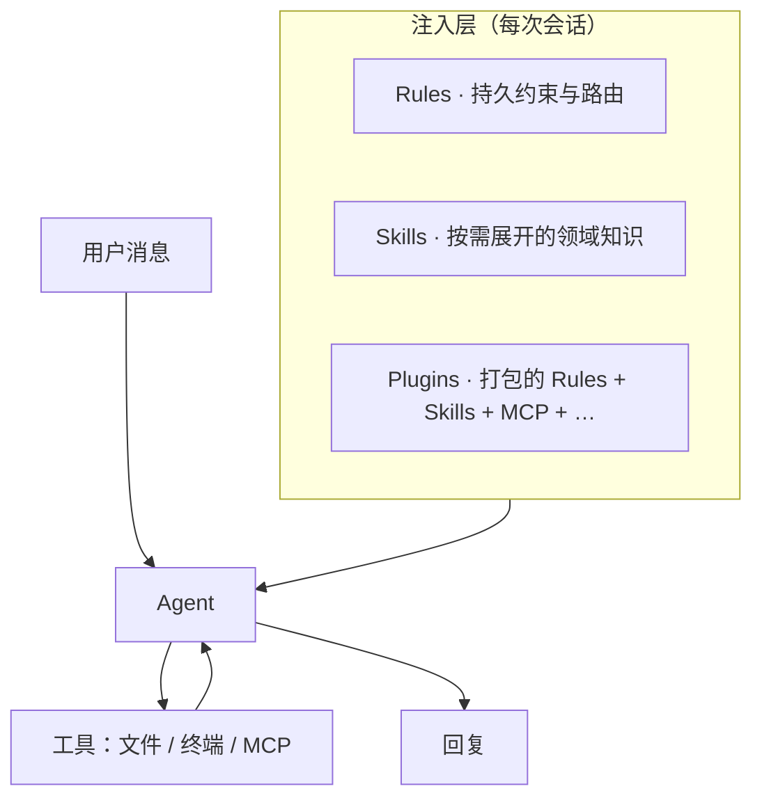
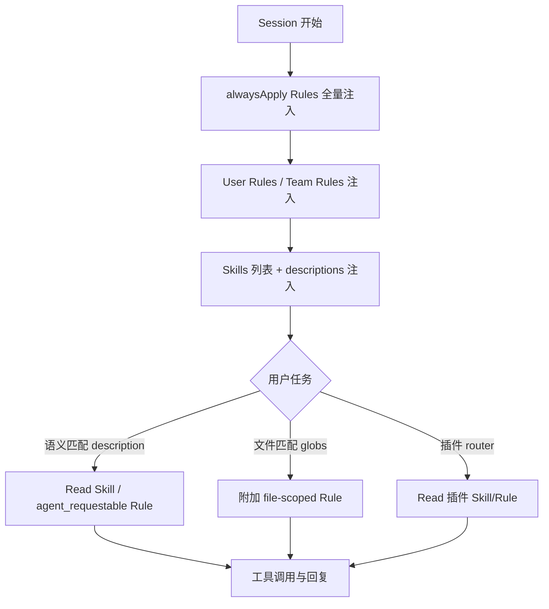

import { FileTree } from '@astrojs/starlight/components';

## 问题：无状态模型的「记忆」困境

LLM 每次推理独立，上下文窗口是唯一的「记忆」界面。Agent 要在多轮对话中遵循项目约定、理解领域知识，靠的不是模型权重，而是注入到窗口中的外部文本。这引出两个约束：

1. **窗口容量有限** — 注入内容与用户代码、diff 共享同一 token 配额
2. **信息需分层** — 编码风格应常驻，部署文档应按需，工具指令应埋得更深

Cursor 通过 **Rules、Skills、Plugins** 三层实现上述分层，以下逐一分析。

## 三层注入架构

Agent 的上下文注入可抽象为三层，对应不同的生命周期与触发条件：



### Rules · 约束层

**定位**：持久化行为约束——编码规范、项目约定、文档路由。作用于 Agent 的**决策空间**而非知识空间。

**格式**：`.cursor/rules/*.mdc`，YAML frontmatter + Markdown 正文。

| frontmatter | 注入时机（Cursor 实现） |
| --- | --- |
| `alwaysApply: true` | **Always Apply** — 每轮对话常驻注入 |
| `alwaysApply: false` + `description` | **Apply Intelligently** — Agent 根据 description 语义匹配后 Read（标签 `agent_requestable`） |
| `alwaysApply: false` + `globs` | **Apply to Specific Files** — 匹配文件进入上下文时附加 |
| 三者皆无 | 通过 `@rule名` 手动引用 |

**设计权衡**：`alwaysApply: true` 保证约束必达，但每条增加约 500–2000 token 的固定开销。适合放路由 Rule（指向 Skill）、全局编码准则；不适合放大段 API 文档。

本仓库示例——`dev.mdc` 路由 Rule：

```yaml
---
description: wwlight 开发约定；每轮先读 dev skill
alwaysApply: true
---
```

Netlify Plugin 的 router Rule（`netlify-skills-router.mdc`）同理：`alwaysApply: true` 作为路由入口；各功能模块 Rule（如 `netlify-functions.mdc`）设置 `description` + `alwaysApply: false`，按需展开。

**优先级（官方规定）**：同名约束冲突时 **Team Rules → Project Rules → User Rules**。注意：User Rules **不**作用于 Inline Edit（Cmd/Ctrl+K）。

### Skills · 知识层

**定位**：可复用的**领域知识与工作流**——步骤清单、API 参考、路径表、输出模板。与 Rule 的「约束」定位互补，Skill 侧重「知识展开」。

**格式**：目录 + `SKILL.md`（+ 可选 `references/`），frontmatter 至少含 `name`、`description`。

```yaml
---
name: dev
description: wwlight.github.io development — routes, vpr scripts, refactoring, Tailwind v4, docs.
---
```

**注入机制**：Agent 启动时获取 Skills **列表与 description**；匹配到相关任务后 **Read 整个 SKILL.md**（及链式引用的子文件）。`disable-model-invocation: true`（create-skill 默认值）时仅支持 `/skill-name` 或 `@skill` 显式调用。

**Rule 与 Skill 的分工原则**

| 放 Rule | 放 Skill |
| --- | --- |
| 短、硬约束（alwaysApply） | 长流程、多文件引用 |
| 「必须先做 X」 | 「做 X 时读 Y、再 Z、参考 W」 |
| 路由到 Skill（如 router） | 具体 API 表、命令速查、路径清单 |
| 全局编码准则 | 模块文档 |

**Token 视角**：Rule 常驻注入（固定开销），Skill 按需 Read（用时才占窗口）。大段参考文档（如 API 表、重构清单）放 Skill + references/ 比放 alwaysApply Rule 更经济。

Cursor 提供 **migrate-to-skills**：带 `description`、无 `globs`、非 `alwaysApply` 的 Rule 可迁为 Skill，降低常驻 token 消耗。

### Plugins · 打包层

**定位**：可安装的扩展包，将 Rules、Skills、MCP Servers 等打包为统一分发单元。

| 组件 | 说明 |
| --- | --- |
| Rules | `.mdc` 持久指引（含 router） |
| Skills | `SKILL.md` 领域工作流 |
| MCP Servers | 外部工具接入（如 Figma、MDN） |
| Agents / Commands / Hooks | 子代理、斜杠命令、事件钩子 |

安装后缓存于 `~/.cursor/plugins/cache/...`。本环境已安装：Netlify（21 条 topic rules + skills）、Figma（skills + MCP）、shadcn、GSAP 等。

Plugin 的 Rule 与项目 `.cursor/rules/` **并存**；官方未定义粒度优先级，实践中 **项目 alwaysApply Rule + 插件 router** 同时生效，Agent 按 description 语义匹配后按需 Read 插件内 Skill/Rule。

## 作用域与存储位置

### Rules 的三级作用域

| 位置 | 范围 |
| --- | --- |
| `.cursor/rules/` | **项目**，可入库共享 |
| Cursor Settings → Rules | **用户**，跨项目；Agent Chat 有效 |
| Team dashboard | **组织** |

### Skills 的多路径发现

Cursor 与 [Agent Skills 开放标准](https://cursor.com/docs/skills) 均支持多路径 Skill 发现：

| 路径 | 作用域 | 典型来源 |
| --- | --- | --- |
| `.cursor/skills/` | 项目 | 手写、`create-skill` 推荐 |
| `.agents/skills/` | 项目 | `npx skills add`（Skills CLI 默认路径） |
| `~/.cursor/skills/` | 用户全局 | 个人 Skill |
| `~/.agents/skills/` | 用户全局 | CLI 全局安装 |

**注意**：`~/.cursor/skills-cursor/` 为 Cursor 内置 Skill 专用目录，不应手动创建或修改。

### Subagents（补充）

自定义子代理路径及优先级：

| 位置 | 优先级 |
| --- | --- |
| `.cursor/agents/` | 高（项目） |
| `~/.cursor/agents/` | 低（用户） |

同名 subagent **项目覆盖用户**。

## `.agents/skills` 与 `.cursor/skills` 的关系

两者在 Cursor 中均为**项目级 Skill 发现路径**，运行时等价；差异主要在**工具链约定**：

- **`.cursor/skills/`** — 本仓库手写的项目 Skill（如 `dev`）
- **`.agents/skills/`** — Skills CLI 安装的项目 Skill（本仓可为空；`find-skills` 等建议装全局 `~/.agents/skills/`）

<FileTree>

- .cursor/
  - rules/
    - dev.mdc
  - skills/
    - dev/SKILL.md
    - dev/reference.md
    - dev/tailwindcss.md
- ~/.cursor/rules/
  - karpathy-guidelines.mdc

</FileTree>

### 同名 Skill 与优先级

**官方未明确**以下场景的覆盖顺序：
- `.agents/skills/foo` 与 `.cursor/skills/foo` 同名
- 项目 Skill 与用户 `~/.cursor/skills/` 的同名 Skill

工程实践建议：

1. **避免同名** — 项目内 CLI 安装与手写不撞名
2. **单一入口** — alwaysApply Rule 指向唯一入口 Skill（本仓库：`dev`）
3. **版本管理** — CLI 全局安装记录在 `~/.agents/.skill-lock.json`；`vpx skills update` 升级（本仓用 Vite+ 时以 `vpx` 代替 `npx`）

## 会话加载流程（概念模型）

官方未发布完整注入算法；结合文档与行为可推导以下流程：



**Token 预算视角**：alwaysApply 越多、Skill 正文越长，留给 diff 与推理的空间越小。Karpathy 类行为准则、项目路由适合 Rule（常驻短文本）；API 参考、重构清单适合 Skill + 按需 Read（用时展开）。

## 本仓库的上下文分层设计

| 层 | 文件 | 职责 |
| --- | --- | --- |
| 行为准则 | `~/.cursor/rules/karpathy-guidelines.mdc`（全局 alwaysApply） | 最小改动、先澄清再写码 |
| 项目路由 | `dev.mdc`（alwaysApply） | 每轮 Read `dev/SKILL.md` |
| 项目知识 | `.cursor/skills/dev/` | `reference.md`：路径/路由、重构；`tailwindcss.md` |
| CLI 扩展 | `~/.agents/skills/find-skills` 等（全局） | 发现与安装社区 Skill |
| 部署平台 | Netlify Plugin rules/skills | Functions、Database、deploy 等 |

:::tip[设计 Skill 的原则]
`description` 写明 **触发条件与作用域**（第三人称）；正文保持简短，细节放 `references/` 或模块 README，由 Agent 按需 Read。
:::

## 与 User Rules 的交互

Settings 中的 **User Rules**（如「仅在明确请求时 commit」）与项目 Rule **叠加生效**。冲突时以 **Team → Project → User** 优先级裁定；同一层级内应保持职责不重叠。

**关键限制**：Inline Edit（Cmd/Ctrl+K）不读取 User Rules——若某约束需在 Inline Edit 中也生效，必须放入项目 `.mdc`（`alwaysApply: true`）或 Team Rules。

## 延伸阅读

- [Cursor · Rules](https://cursor.com/docs/context/rules)
- [Cursor · Skills](https://cursor.com/docs/skills)
- [Cursor · Plugins](https://cursor.com/docs/plugins)
- 本仓库：[CURSOR.md](https://github.com/wwlight/wwlight.github.io/blob/main/CURSOR.md)（`.cursor/` 速查）
- 下一篇：[上下文压缩：Token 经济学与 Headroom 实践](/blog/ai/04-context-compression/)
