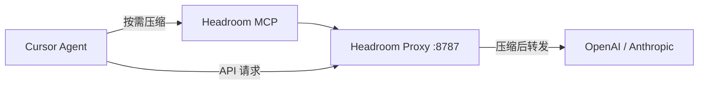

import { LinkCard } from '@astrojs/starlight/components';

## 为什么需要上下文压缩

Agent 每次工具调用（读文件、grep、构建日志）都会向上下文窗口追加大量文本。如果不加控制，以下问题会随对话轮次累积：

| 问题 | 影响 |
| --- | --- |
| **Token 成本线性增长** | 多轮对话中，每次请求都携带完整历史；tool 输出 10KB，10 轮后至少增长 100KB |
| **窗口容量挤压** | 上下文窗口被历史 tool 输出占满，留给新代码、diff、推理的空间减少 |
| **模型性能退化** | 上下文越长，LLM 注意力分散，关键信息被稀释——即「lost in the middle」效应 |
| **延迟增加** | 更大的请求体意味着更长的网络传输与首 token 延迟 |

**上下文压缩**的核心思想：在 tool 输出进入对话历史之前，用结构化摘要或关键段替代原始内容，减小 token 体积的同时保留语义信息。

### Token 成本速算

| 模型 | 输入 $/1M tokens | 典型 50KB tool 输出 | 10 轮累积成本 |
| --- | --- | --- | --- |
| GPT-4o | ~$2.50 | ~$0.03 | ~$0.30 |
| Claude 3.5 Sonnet | ~$3.00 | ~$0.04 | ~$0.40 |
| Claude Opus | ~$15.00 | ~$0.19 | ~$1.90 |

> 以上为估算值。实际成本取决于 tokenizer 分词密度、system prompt 大小及模型定价变化。

压缩率 70–90% 时，上述成本可降为原来的 1/3–1/10。对于高频 Agent 使用场景（日均 50+ 轮对话），差异显著。

本文以 **Headroom** 为实践载体，记录其 proxy + MCP 双通道接入方式。依据 [Headroom 官方文档](https://headroom-docs.vercel.app/)（Installation → Docker、Proxy Server、MCP Tools）。

## Headroom 与 rtk 的分工

两种压缩机制作用于不同层面，可并存：

| 工具 | 压缩对象 | 介入层 |
| --- | --- | --- |
| **Headroom** | 发送给 LLM 的 **messages**（对话 + tool 结果） | API / proxy 层（`:8787`）+ MCP 按需 |
| **rtk** | Shell 命令的 **终端 stdout** | 命令执行层（Cursor `preToolUse` hook） |



## 安装

[Installation → Docker](https://headroom-docs.vercel.app/docs/installation#docker) 提供容器化部署：

```bash
docker pull ghcr.io/chopratejas/headroom:latest

docker run -d \
  --name headroom \
  --restart unless-stopped \
  -p 8787:8787 \
  ghcr.io/chopratejas/headroom:latest
```

需通过 proxy 转发到真实 API 时，注入 provider 密钥：

```bash
docker rm -f headroom

docker run -d \
  --name headroom \
  --restart unless-stopped \
  -p 8787:8787 \
  -e ANTHROPIC_API_KEY=sk-ant-... \
  -e OPENAI_API_KEY=sk-... \
  ghcr.io/chopratejas/headroom:latest
```

### 验证

```bash
curl http://127.0.0.1:8787/health
curl http://127.0.0.1:8787/stats
```

`/health` 返回 `"status":"healthy"` 即 proxy 就绪。

## 配置 Cursor MCP

[MCP Tools](https://headroom-docs.vercel.app/docs/mcp) 暴露三个工具：

| 工具 | 功能 |
| --- | --- |
| `headroom_compress` | 按需压缩大段内容（JSON、日志、搜索结果） |
| `headroom_retrieve` | 通过 hash 取回原始内容，支持 `query` 参数定向搜索 |
| `headroom_stats` | 查询当前会话的压缩统计 |

Proxy 运行时也暴露 HTTP 端点 `http://127.0.0.1:8787/mcp`。推荐使用 **stdio + docker exec**（容器须名为 `headroom` 且运行中）：

```json
{
  "mcpServers": {
    "headroom": {
      "command": "docker",
      "args": ["exec", "-i", "headroom", "headroom", "mcp", "serve"]
    }
  }
}
```

写入 **`~/.cursor/mcp.json`**（全局）或项目 **`.cursor/mcp.json`**，与其它 MCP Server（如 `mdn`）并列即可。

:::note[HTTP 备选]
文档亦支持 `"type": "http", "url": "http://127.0.0.1:8787/mcp"`。若连接异常，优先改用上面的 stdio 方案。
:::

### 生效与验证

1. 确认 `docker ps` 中 `headroom` 为 **Up (healthy)**
2. **重启 Cursor**，或 **Settings → Tools & MCP** 查看 `headroom` 绿点
3. Agent 对话中应能调用 `headroom_compress` / `headroom_stats`

容器内自检：

```bash
docker exec headroom headroom mcp status
```

### MCP 与 Proxy 的关系

- **Proxy（`:8787`）**：HTTP 层自动压缩所有经 proxy 的 LLM 流量
- **MCP 工具**：Agent 按需调用压缩 / 取回 / 统计；与 proxy 共用压缩管道，**不会**对同一内容重复压缩

仅需 MCP、无需全量 proxy 的场景，可 `pip install "headroom-ai[mcp]"` 后执行 `headroom mcp serve`。

## 三种接入路径

Headroom 提供三条互不排斥的路径，按使用场景组合。

### 路径 A：Cursor MCP（按需压缩）

Agent 在对话中按需调用 MCP 工具——适合「tool 输出过大，先压缩再推理」的场景：

| 场景 | 工具 | 用法 |
| --- | --- | --- |
| grep / 测试输出过长 | `headroom_compress` | 传入 `content`，获得 `compressed` + `hash` |
| 压缩后需查阅原文 | `headroom_retrieve` | 传入 `hash`；可选 `query` 在原文中定向检索 |
| 查看会话压缩统计 | `headroom_stats` | 返回 `tokens_saved`、`savings_percent`、最近事件 |

压缩结果示例（[MCP 文档](https://headroom-docs.vercel.app/docs/mcp)）：

```json
{
  "compressed": "[key matches with context...]",
  "hash": "a1b2c3d4e5f6...",
  "original_tokens": 12000,
  "compressed_tokens": 3200,
  "savings_percent": 73.3,
  "transforms": ["router:search:0.27"]
}
```

原文在本地 store 保留约 **1 小时**；proxy store 约 **5 分钟**。过期后 `headroom_retrieve` 返回 not found，需从源重新获取。

在 Cursor 中可直接对 Agent 说：「用 headroom 压缩这段输出再分析」。

### 路径 B：Proxy 全量自动压缩

将 LLM 客户端的 API 地址指向 `http://127.0.0.1:8787`，**每次请求**的 messages 在转发前自动压缩。详见 [Quickstart → proxy mode](https://headroom-docs.vercel.app/docs/quickstart#alternative-proxy-mode-zero-code-changes) 与 [Proxy → Agent wrapping](https://headroom-docs.vercel.app/docs/proxy#agent-wrapping)。

```bash
# Claude Code
ANTHROPIC_BASE_URL=http://127.0.0.1:8787 claude

# OpenAI 兼容
OPENAI_BASE_URL=http://127.0.0.1:8787/v1 your-app
```

Docker 容器需配置对应 `ANTHROPIC_API_KEY` / `OPENAI_API_KEY`，proxy 才会转发到真实 API。

#### Cursor 桌面版：`headroom wrap cursor`

[Proxy 文档](https://headroom-docs.vercel.app/docs/proxy#agent-wrapping) 支持 `headroom wrap cursor`。该命令会打印 Cursor 需填写的 Base URL（**不会**自动写入 Cursor Settings），并按**当前工作目录名**生成按项目归因的 `/p/<目录名>/` 前缀。

直接在 Cursor 填入以下格式的 URL（将 `<目录名>` 替换为项目根目录文件夹名）：

| 模型类型 | Override Base URL | API Key |
| --- | --- | --- |
| OpenAI 兼容 | `http://127.0.0.1:8787/p/<目录名>/v1` | 你的 OpenAI Key |
| Anthropic（proxy 侧） | `http://127.0.0.1:8787/p/<目录名>` | 你的 Anthropic Key |

:::caution[Cursor 能力边界]
- Cursor 仅有 **Override OpenAI Base URL** 入口；`headroom wrap cursor` 打印的 Anthropic Base URL 供 proxy 路由参考，**Claude BYOK 当前无独立 Anthropic Override**，不保证走 proxy
- **Agent / Composer / Tab 补全**不一定全部走 BYOK proxy；Cursor 订阅内置模型走自家后端。不确定时，以 `/stats` 的 `api_requests` 为依据，与 **路径 A（MCP）** 并用
:::

验证 proxy 是否收到 Cursor 流量：`curl -s http://127.0.0.1:8787/stats` 中 `summary.api_requests` 应在对话后 > 0。

**获取 wrap 打印的完整说明**（在项目根目录执行）：

```bash
# 已装 headroom CLI
headroom wrap cursor

# 或临时容器（挂载当前目录，保留目录名用于 /p/<目录名>/ 归因）
docker run --rm --entrypoint headroom \
  -v "$(pwd):$(pwd)" -w "$(pwd)" \
  ghcr.io/chopratejas/headroom:latest wrap cursor
```

执行后将打印类似以下内容：OpenAI 用 `http://127.0.0.1:8787/p/<项目名>/v1`，Anthropic 用 `http://127.0.0.1:8787/p/<项目名>`，`<项目名>` 为当前目录名。同时向 `.cursorrules` 注入 rtk 终端过滤说明。

### 路径 C：纯压缩（不调 LLM）

[Proxy → POST /v1/compress](https://headroom-docs.vercel.app/docs/proxy#post-v1compress) 仅运行压缩管道，适合脚本集成或功能验证：

```bash
curl -X POST http://127.0.0.1:8787/v1/compress \
  -H 'Content-Type: application/json' \
  -d '{
    "messages": [{"role": "user", "content": "很长的内容..."}],
    "model": "gpt-4o"
  }'
```

响应含 `tokens_before`、`tokens_after`、`tokens_saved`、`compression_ratio`、`transforms_applied`。设置请求头 `x-headroom-bypass: true` 可跳过压缩做对照实验。

### 推荐组合

| 组件 | 作用 |
| --- | --- |
| `headroom` 容器 `:8787` | proxy 常驻，提供 `/stats`、MCP 后端、路径 B/C |
| `~/.cursor/mcp.json` → `headroom` | Cursor Agent 按需 `compress` / `retrieve` / `stats` |
| Cursor **Override OpenAI Base URL**（可选） | BYOK 全量走 proxy；URL 形如 `http://127.0.0.1:8787/p/<目录名>/v1` |

Proxy 压缩 **HTTP 流量**，MCP 压缩 **Agent 主动提交的大块内容**；二者数据面独立，[不会双重压缩](https://headroom-docs.vercel.app/docs/mcp#mcp--proxy-full-setup)。

## 验证压缩效果

### 1. 实时统计：`GET /stats`

```bash
curl http://127.0.0.1:8787/stats | python3 -m json.tool
```

关键字段：

| 路径 | 含义 |
| --- | --- |
| `summary.api_requests` | 经 proxy 转发的 API 请求数（路径 B） |
| `summary.compression.requests_compressed` | 触发压缩的请求数 |
| `summary.compression.total_tokens_removed` | 累计节省 token |
| `summary.compression.avg_compression_pct` | 平均压缩比例 |
| `summary.cost.total_saved_usd` | 估算节省费用（美元） |
| `summary.mcp.compressions` | MCP `headroom_compress` 调用次数 |
| `summary.mcp.tokens_removed` | MCP 路径节省 token |
| `agent_usage.totals.tokens_saved` | 按 agent 聚合的节省量 |

**全为 0** 表示尚无流量经过 proxy 或 MCP——容器 healthy 仅说明服务就绪，不代表已产生压缩。

### 2. 健康摘要：`GET /health`

```bash
curl http://127.0.0.1:8787/health
```

除 `status: healthy` 外，`stats` 块通常含 `total_requests`、`tokens_saved`、`savings_percent` 的简要汇总。

### 3. 历史趋势：`GET /stats-history`

```bash
curl http://127.0.0.1:8787/stats-history
curl "http://127.0.0.1:8787/stats-history?format=csv&series=weekly"
```

按小时 / 日 / 周 / 月 rollup，数据持久化在容器内 `~/.headroom/proxy_savings.json`（可通过 volume 挂载持久化）。若镜像启用 dashboard，浏览器访问 `http://127.0.0.1:8787/dashboard` 查看图表。

### 4. Prometheus 指标：`GET /metrics`

```bash
curl http://127.0.0.1:8787/metrics
```

示例指标：`headroom_tokens_saved_total`、`headroom_requests_total`、`headroom_compression_ratio_bucket`。适合接入 Grafana 等监控系统。

### 5. Cursor 内：`headroom_stats` MCP

在 Agent 对话中调用 `headroom_stats`，或确认 Settings → Tools & MCP 中 `headroom` 已连接后，直接询问「当前 headroom 压缩统计」。返回 `compressions`、`tokens_saved`、`recent_events`（最近 10 条压缩/取回记录）。

### 6. 容器日志

```bash
docker logs -f headroom
```

启动时打印路由表（`/v1/messages`、`/v1/chat/completions`、`/mcp` 等）。请求经 proxy 时若日志级别为 `INFO` 可见处理记录；排错可添加环境变量 `HEADROOM_LOG_LEVEL=DEBUG` 重建容器。

### 自检清单

```bash
# 容器与 proxy 是否就绪
docker ps --filter name=headroom
curl -s http://127.0.0.1:8787/health

# MCP 是否在线（Cursor 侧）
docker exec headroom headroom mcp status

# 路径 C 手动压测
curl -s -X POST http://127.0.0.1:8787/v1/compress \
  -H 'Content-Type: application/json' \
  -d '{"messages":[{"role":"assistant","content":"重复日志..."}],"model":"gpt-4o"}'

# 查看累计统计
curl -s http://127.0.0.1:8787/stats
```

`/v1/compress` 响应中 `tokens_saved` > 0 即压缩生效。Cursor MCP 使用后 `summary.mcp.compressions` 递增；Cursor Override proxy 生效后 `summary.api_requests` 递增。

## 接入其它客户端

Claude Code、Codex、Aider 等 CLI 见 [Proxy → Agent wrapping](https://headroom-docs.vercel.app/docs/proxy#agent-wrapping)：

```bash
headroom wrap claude    # 或 codex / aider
ANTHROPIC_BASE_URL=http://127.0.0.1:8787 claude
OPENAI_BASE_URL=http://127.0.0.1:8787/v1 your-app
```

Cursor 桌面版见上文 **路径 B → `headroom wrap cursor`**。

## 日常运维

```bash
docker ps --filter name=headroom
docker logs -f headroom
docker restart headroom
curl http://127.0.0.1:8787/stats
curl http://127.0.0.1:8787/stats-history
```

若 `docker` 报 daemon 未连接，需先启动 Docker。

## 压缩效果参考

| 内容类型 | 典型节省 |
| --- | --- |
| JSON 数组 | 70–90% |
| 构建/测试日志 | 80–95% |
| 搜索结果 | 60–80% |
| 源代码 | 40–70% |

详见 [How Compression Works](https://headroom-docs.vercel.app/docs/how-compression-works)。

## 卸载

```bash
docker rm -f headroom
docker rmi ghcr.io/chopratejas/headroom:latest   # 可选：删除镜像
```

从 `~/.cursor/mcp.json` 移除 `headroom` 条目并重启 Cursor。

## 延伸阅读

<LinkCard
  title="Headroom Proxy Server"
  href="https://headroom-docs.vercel.app/docs/proxy"
  description="Agent wrapping、/v1/compress、/stats 与 headroom wrap cursor"
/>
<LinkCard
  title="Headroom MCP Tools"
  href="https://headroom-docs.vercel.app/docs/mcp"
  description="compress / retrieve / stats 与 Streamable HTTP"
/>
<LinkCard
  title="Headroom Quickstart"
  href="https://headroom-docs.vercel.app/docs/quickstart"
  description="SDK compress() 与 proxy 零改代码两种模式"
/>
<LinkCard
  title="上一篇：上下文注入：Rules、Skills 与 Plugins"
  href="/blog/ai/03-context-injection/"
  description="Agent 外部知识注入：分层架构、加载顺序与 Token 预算"
/>
