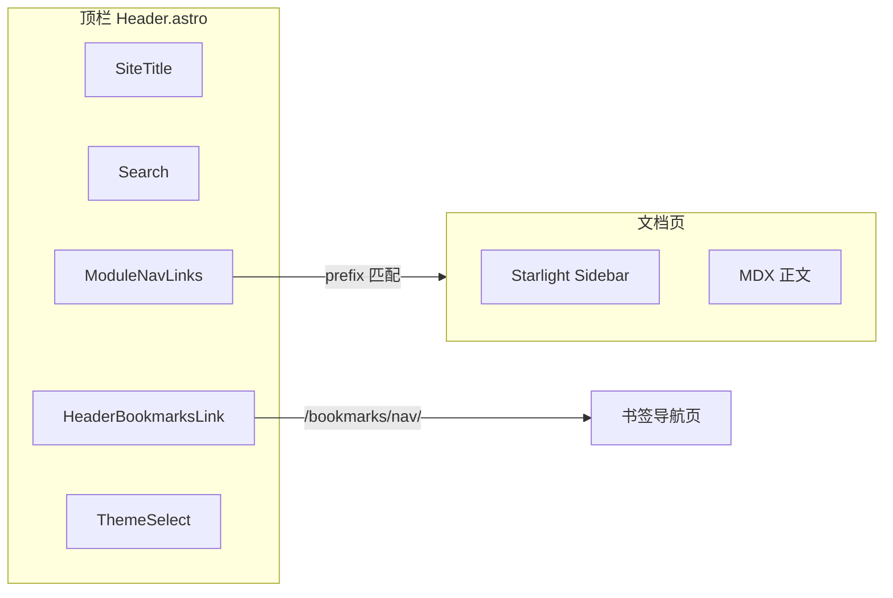

import { Steps, FileTree } from '@astrojs/starlight/components';

站点同时存在 **文档内导航**（Starlight 左侧 sidebar）和 **跨模块导航**（顶栏在「博客 / 备忘录 / 工具集 …」之间切换）。书签页在 Starlight 之外，需要单独的入口。

## 两层导航模型

| 层级 | 作用域 | 配置位置 | 示例 |
| --- | --- | --- | --- |
| 模块导航 | 整站 | `src/lib/site-nav.ts` | 博客、备忘录、书签 |
| 文档 sidebar | 当前 docs 目录 | `astro.config.mjs` → `starlight.sidebar` | blog / memorandum / tools |



## Starlight sidebar

在 `astro.config.mjs` 中为每个内容目录配置一组 autogenerate：

```js
sidebar: [
  {
    label: '博客',
    items: [
      { label: '总览', link: '/blog/' },
      {
        label: '书签导航与管理端搭建',
        items: [{ autogenerate: { directory: 'blog/bookmarks' } }],
      },
      {
        label: 'Astro 使用',
        items: [{ autogenerate: { directory: 'blog/astro' } }],
      },
    ],
  },
  { label: '备忘录', items: [{ autogenerate: { directory: 'memorandum' } }] },
  // …
],
```

系列索引页（`blog/bookmarks/index.mdx` 等）在 frontmatter 设 `sidebar.hidden: true`，避免侧栏再出现一层「系列目录 + 索引标题」。

<FileTree>

- src/content/docs/
  - blog/
    - index.mdx
    - bookmarks/（index 隐藏于侧栏）
    - starlight/（index 隐藏于侧栏）
  - memorandum/
  - tools/
  - system/
  - other/

</FileTree>

每篇 MDX 的 frontmatter 用 `sidebar.order` 控制同目录内的排序；`title` 即 sidebar 显示名。

## 顶栏模块导航

单一数据源 `siteModuleNav`：

```ts
// src/lib/site-nav.ts
export const siteModuleNav: SiteModuleNavItem[] = [
  { label: "博客", href: "/blog/", prefix: "/blog" },
  { label: "备忘录", href: "/memorandum/dev-qa/", prefix: "/memorandum" },
  // …
];

export function isModuleNavActive(prefix: string, pathname: string) {
  return pathname === prefix || pathname.startsWith(`${prefix}/`);
}
```

`ModuleNavLinks.astro` 读取当前 `pathname`，给匹配项加 `active` class：

```astro
<nav aria-label="模块导航">
  {siteModuleNav.map(item => (
    <a
      href={item.href}
      class:list={['module-nav-link', { active: isModuleNavActive(item.prefix, pathname) }]}
    >
      {item.label}
    </a>
  ))}
</nav>
```

**设计要点：**

- `href` 指向各模块的「默认落地页」，不是目录根（Starlight 路由带 trailing slash）
- `prefix` 用于高亮：只要在 `/blog/xxx/` 下，「博客」就保持 active
- 新增 docs 分区时，**同时改** `astro.config.mjs` sidebar 与 `site-nav.ts`

## 书签入口

书签不属于 Starlight docs，单独定义：

```ts
export const bookmarksNavItem = {
  label: "书签",
  href: "/bookmarks/nav/",
  prefix: "/bookmarks/nav",
} as const;
```

`HeaderBookmarksLink.astro` 放在顶栏右侧（社交图标与主题切换之间），用 SVG 图标节省空间，移动端可通过书签页内 `NavPageActions` 返回文档站。

## 自定义 Header

Starlight 允许替换 Header 组件：

```js
starlight({
  components: {
    Header: './src/components/Header.astro',
    // …
  },
})
```

`Header.astro` 在 Starlight 默认结构上插入 `ModuleNavLinks` 与 `HeaderBookmarksLink`，并用 CSS Grid 在大屏下与 sidebar 列对齐。

## 新增一个 docs 分区

<Steps>

1. 创建目录 `src/content/docs/notes/`，放入至少一篇 `index.mdx`

2. 在 `astro.config.mjs` 的 `sidebar` 数组追加：

   ```js
   { label: '笔记', items: [{ autogenerate: { directory: 'notes' } }] },
   ```

3. 在 `src/lib/site-nav.ts` 追加导航项：

   ```ts
   { label: "笔记", href: "/notes/", prefix: "/notes" },
   ```

4. 重启 `vpr dev`，确认顶栏高亮与 sidebar 自动生成条目

</Steps>

:::tip[书签页不需要改 sidebar]
`/bookmarks/nav/` 是独立页面，不会出现在 Starlight sidebar。用户通过顶栏书签图标或首页 CTA 进入。
:::

## 本章小结

- **sidebar** 管 docs 目录内层级；**ModuleNav** 管跨模块跳转
- 导航配置集中在 `astro.config.mjs` + `site-nav.ts`，避免硬编码散落
- 书签用独立入口组件，与 docs 路由解耦
