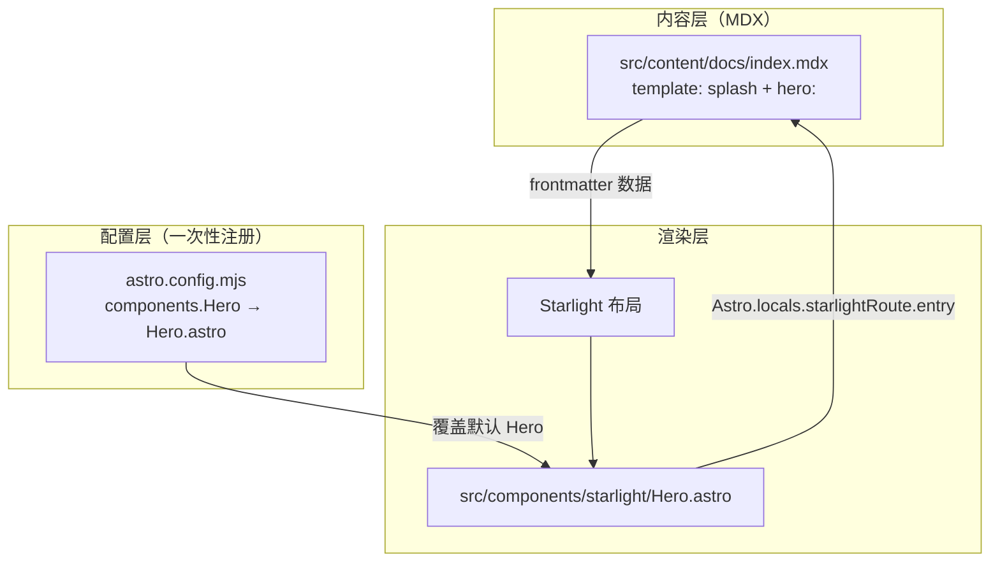

import { Steps, FileTree, LinkCard } from '@astrojs/starlight/components';

本站文档站首页（`/`，对应 `src/content/docs/index.mdx`）使用 Starlight 的 **splash 落地页** + **Hero 区域**。实现上采用官方推荐的 **约定式配置**：内容写在 MDX frontmatter，渲染逻辑在 `astro.config.mjs` 注册一次组件覆盖，**页面里不需要 `import Hero`**。

## 官方文档索引

| 主题 | 说明 | 链接 |
| --- | --- | --- |
| 页面布局 `template: splash` | 无侧栏宽版，适合首页/404 | [Customizing Starlight — Page layout](https://starlight.astro.build/guides/customization/#page-layout) |
| `hero` frontmatter | 标题、标语、图片、按钮 | [Frontmatter Reference — hero](https://starlight.astro.build/reference/frontmatter/#hero) |
| 组件覆盖 `components.Hero` | 全局替换默认 Hero | [Overriding Components](https://starlight.astro.build/guides/overriding-components/) |
| 覆盖项列表 | 可覆盖的组件名（含 `Hero`） | [Overrides Reference](https://starlight.astro.build/reference/overrides/) |
| `Astro.locals.starlightRoute` | 覆盖组件内读取当前页数据 | [Route Data](https://starlight.astro.build/guides/route-data/) |
| 默认 Hero 源码 | 对照 fork 的起点 | [starlight/components/Hero.astro](https://github.com/withastro/starlight/blob/main/packages/starlight/components/Hero.astro) |
| Astro 官方示例 | 更复杂的 Hero 定制 | [withastro/docs Hero.astro](https://github.com/withastro/docs/blob/main/src/components/starlight/Hero.astro) |

## 先分清两件事：首页文件 ≠ Hero 组件



| 角色 | 路径 | 作用 |
| --- | --- | --- |
| **首页内容** | `src/content/docs/index.mdx` | 声明 `title`、`template: splash`、`hero`（标语、图、按钮）；路由为文档站根路径 |
| **Hero 实现** | `src/components/starlight/Hero.astro` | 全站替换 Starlight 内置 Hero；凡带 `hero:` 的页面都会走这份实现（本站目前只有首页） |

因此：**`Hero.astro` 不是「首页文件」**，而是 Starlight 的 **可覆盖插槽**；首页只是通过 frontmatter **消费** 它。

## 约定式配置：为何 MDX 里不用 import

Starlight 的 Hero 与 Header、Footer 一样，属于 **集成级组件覆盖**，在 `starlight({ components: { … } })` 里注册即可。

```js
// astro.config.mjs（节选）
starlight({
  components: {
    Header: './src/components/Header.astro',
    Footer: './src/components/Footer.astro',
    Hero: './src/components/starlight/Hero.astro',
  },
})
```

数据流：

1. 某篇 MDX 的 frontmatter 含 `hero:`（通常配合 `template: splash`）。
2. Starlight 布局在页面顶部渲染 **已注册的** `Hero` 组件。
3. `Hero.astro` 通过 `Astro.locals.starlightRoute.entry` 读取该页的 `data`（含 `hero`、`title`、`draft` 等）。

这与在 MDX 里写 `import Hero from '…'` 再手动挂载 **不是同一条路**；后者适用于正文里的 **MDX 组件**（见 [Using Components](https://starlight.astro.build/guides/components/)），不用于替换 Starlight 布局插槽。

:::note
覆盖是 **全局** 的：所有带 `hero` 的页面都会用你的 `Hero.astro`。若只想改首页，可在组件内用 `Astro.locals.starlightRoute.id` 等做条件分支（[Overriding Components — 条件渲染](https://starlight.astro.build/guides/overriding-components/)）。本站仅 `index.mdx` 配置了 `hero`，等价于「只有首页展示 Hero UI」。
:::

## 首页 frontmatter：内容与布局分离

```yaml
# src/content/docs/index.mdx
---
title: 与光同行
template: splash   # 宽版、无文档侧栏与正文 TOC
next: false        # 隐藏系列「下一篇」
hero:
  tagline: 记录个人学习笔记
  image:
    file: ../../assets/logo.svg
    alt: generated
  actions:
    - text: 书签导航
      link: /bookmarks/nav/
      icon: right-arrow
    - text: 博客
      link: /blog/
      icon: right-arrow
    - text: 随机主题
      link: '#random-theme'
      variant: minimal
---
```

### `template: splash`

见 [Page layout](https://starlight.astro.build/guides/customization/#page-layout)：默认文档页是 `doc`（侧栏 + 目录），`splash` 去掉侧栏，给 Hero 更大横向空间。404 页也常用同一模板（[Custom 404 page](https://starlight.astro.build/guides/customization/#custom-404-page)）。

### `hero` 字段（官方 `HeroConfig`）

类型定义见 [Frontmatter — hero / HeroConfig](https://starlight.astro.build/reference/frontmatter/#heroconfig)：

| 字段 | 本站用法 |
| --- | --- |
| `title` | 省略时用页面 `title`（「与光同行」） |
| `tagline` | 副标题 HTML |
| `image.file` + `image.alt` | 见下文「generated 约定」 |
| `image.dark` / `image.light` | 官方支持明暗双图；本站用 generated 路径未启用 |
| `image.html` | 原始 HTML/SVG 插槽 |
| `actions[]` | `text`、`link`、`icon`、`variant`、`attrs`；`link` 可映射为自定义行为 |

改首页文案、按钮链接：**只改 `index.mdx`**，无需动 `Hero.astro`（除非要新增交互类型）。

## 自定义 `Hero.astro` 做了什么

本站实现以 Starlight 默认 [Hero.astro](https://github.com/withastro/starlight/blob/main/packages/starlight/components/Hero.astro) 为基底，保留网格布局、`LinkButton`、`astro:assets` 的 `Image` 与 `@layer starlight.core` 样式，并增加三处 **项目约定**。

<FileTree>

- src/components/starlight/
  - Hero.astro
- src/content/docs/
  - index.mdx
- src/components/
  - GeneratedLogo.astro
- src/theme/components/
  - HeroRandomThemeButton.tsx

</FileTree>

### 1. 读取路由数据

```astro
const { data } = Astro.locals.starlightRoute.entry
const { title = data.title, tagline, image, actions = [] } = data.hero || {}
```

- `entry`：当前内容集合条目（MDX frontmatter 解析结果）。
- 详见 [Route Data — Using route data](https://starlight.astro.build/guides/route-data/#using-route-data)。

### 2. 图片：`alt: generated` → 动态 Logo

官方 `image` 支持 `file`、`dark`/`light`、`html`。本站约定：**当 `image.alt === 'generated'`** 时不走 `Image`，改为渲染 `GeneratedLogo`（描边 SVG，随全站主题色变化）。

```astro
const useGeneratedLogo = image?.alt === 'generated'
// …
{useGeneratedLogo && <GeneratedLogo class="hero-logo" />}
```

`index.mdx` 仍保留 `file: ../../assets/logo.svg` 以满足 schema；实际展示由 `GeneratedLogo` 负责。这是 **frontmatter 与覆盖组件之间的私有约定**，不在 Starlight 官方 schema 内。

### 3. 按钮：`#random-theme` → React 岛屿

`actions` 默认渲染 Starlight 的 [`LinkButton`](https://starlight.astro.build/guides/components/)（`@astrojs/starlight/components`）。本站对 `link === '#random-theme'` 做分支，挂载客户端组件：

```astro
if (href === '#random-theme') {
  return <HeroRandomThemeButton client:load />
}
```

`HeroRandomThemeButton` 调用 `randomThemeCustomizerState()`，只随机 Primary / Neutral / Radius，不改 Color Mode（实现见 `src/theme/components/HeroRandomThemeButton.tsx`）。  
`#random-theme` 同样是 **项目内约定 URL**，不会真的跳转。

### 4. 草稿提示

保留 Starlight 虚拟组件 `DraftContentNotice`（`virtual:starlight/components/DraftContentNotice`），在 `data.draft` 时显示草稿条。

### 5. 样式层

样式写在组件内 `<style>` 的 `@layer starlight.core`，与默认 Hero 一致，避免打乱 Starlight 层级。大屏为 **7:4 两列**（文案左、图右），小屏单列居中——逻辑与上游默认 Hero 相同。

## 与默认 Hero 的差异一览

| 能力 | Starlight 默认 | 本站 `Hero.astro` |
| --- | --- | --- |
| 数据来源 | `data.hero` | 相同 |
| 图片 | `file` / `dark`+`light` / `html` | 上述 + **`alt: generated` → GeneratedLogo** |
| 操作按钮 | 全部 `LinkButton` | `LinkButton` + **`#random-theme` → React** |
| 草稿 | 支持 `DraftContentNotice` | 保留 |
| 注册方式 | 内置 | `components.Hero` 覆盖 |

## 推荐改动路径

<Steps>

1. **只改文案/链接**  
   编辑 `src/content/docs/index.mdx` 的 `hero` / `title` / `tagline` / `actions`。

2. **改 Hero 布局或样式**  
   编辑 `src/components/starlight/Hero.astro` 的 markup 或 `@layer starlight.core` 样式。

3. **新增一种「特殊按钮」**  
   在 `actions` 里约定新的 `link` 值（如 `#foo`），在 `Hero.astro` 的 `actions.map` 里分支渲染对应组件。

4. **换 Logo 策略**  
   去掉 `alt: generated`，改用官方 `file` 或 `dark`/`light`；或扩展新的 `alt` 约定。

5. **仅首页用定制 Hero**  
   在 `Hero.astro` 顶部判断 `Astro.locals.starlightRoute.id === ''`（或 slug），非首页 `import Default from '@astrojs/starlight/components/Hero.astro'` 渲染默认实现（需查当前 Starlight 版本是否导出默认组件，或复制默认 markup）。

</Steps>

## 和本站其他模块的关系

- **顶栏主题**：`Header.astro` + `ColorThemeSelect` / `ThemeCustomizerPopover`（另一套覆盖），与 Hero 内「随机主题」共用 `src/theme/` 状态，但入口不同。
- **书签 / 管理端**：不在 Starlight 布局内，不走 `Hero`；首页 `actions` 链到 `/bookmarks/nav/`、`/blog/`。

## 小结

| 问题 | 答案 |
| --- | --- |
| `Hero.astro` 是首页吗？ | 否；首页是 `index.mdx`，Hero 是全局覆盖的渲染组件。 |
| 要在 MDX 里 import Hero 吗？ | 不需要；用 `hero` frontmatter + `components.Hero` 注册。 |
| 内容写在哪？ | `index.mdx` 的 `template` / `hero` / `actions`。 |
| 逻辑写在哪？ | `src/components/starlight/Hero.astro`（及 `GeneratedLogo`、`HeroRandomThemeButton`）。 |

frontmatter 提供 `data.hero`；`Hero.astro` 通过 `Astro.locals.starlightRoute.entry` 读取并渲染。

**相关：** [01 · 站点导航](/blog/astro/01-site-navigation/) · 随机主题见 `src/theme/components/HeroRandomThemeButton.tsx`
