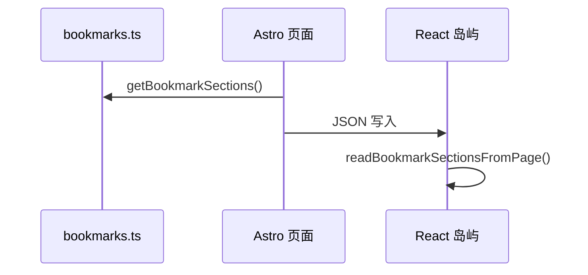

import { Steps, FileTree } from '@astrojs/starlight/components';

## 问题背景

个人站点通常有两类内容：

1. **文档笔记** — 适合 Markdown，用 Starlight 自带 sidebar 组织
2. **结构化导航** — 大量链接、分区、卡片分组，纯 MDX 维护成本高

书签模块解决的是第二类需求：按 **Section → Card → Bookmark** 三层组织链接，并提供搜索、分区 Tab、徽章等 UI。

同时希望：

- 线上是 **静态站点**（GitHub Pages / Vercel / Netlify）
- 本地有一个 **可视化管理端**，改完能 commit 进 Git
- 不引入独立后端数据库服务

## 模块边界

<FileTree>

- src/bookmarks/
  - README.md — 模块目录与数据流
  - shared/
    - types.ts — Section / Card / Bookmark 领域类型
    - data/ — queries、page-data、serialize
    - lib/ — 搜索、统计、Tab、favicon、badge
    - components/ — BookmarkFavicon、BookmarkPageHeader、BookmarkSettingsIcon、StatsCards
    - styles/ — bookmarks-theme-shared.css、bookmarks-card.css
  - nav/
    - components/ — NavBookmarksPage、卡片与 Tab
    - styles/ — bookmarks-page.css
  - admin/
    - lib/ — 鉴权、API、拖拽 CRUD、api.server
    - components/ — AdminApp、对话框、卡片网格
    - styles/ — admin.css、bookmarks-app.css
  - nav/entry.astro — 导航 Astro 入口（injectRoute）→ `/bookmarks/nav/`
  - admin/entry.astro — 管理端 Astro 入口（injectRoute）→ `/bookmarks/admin/`
- db/
  - data/bookmarks.ts — 唯一可提交数据源
- integrations/bookmarks-admin.ts — dev `/admin/api/*`

</FileTree>

文档站与书签模块 **共用 `@/theme` 全站偏好**（`wwlight:color-*` + `init.inline.js`），但书签页 **不走 Starlight 布局**——独立 Astro 页面挂载 React 根组件，导航页可全宽布局。

## 数据流



**关键点：** 运行时 React 不直接读源文件，而是读页面内嵌的 JSON。Astro 在 SSR/SSG 阶段 import `bookmarks.ts`，序列化后注入 DOM。这保证了：

- 导航页可以是 `client:only="react"`，hydration 前已有数据
- 构建产物仍是静态 HTML + JS，无服务端运行时

## 管理端为何「本地可写、线上只读」

静态托管没有持久化磁盘。若在 production 开放 `POST /admin/api/save`，要么失败，要么需要额外后端。

当前方案：

| 环境 | 登录 | 编辑 UI | 保存到文件 |
| --- | --- | --- | --- |
| `astro dev` | ✅ | ✅ | ✅ |
| 静态 build | ✅（门控） | ✅（UI 可见） | ❌ `403 仅开发环境可用` |

线上管理端页面主要用于 **查看当前数据** 或 **导出**；真正改数据在本地 `vpr dev:admin` → commit → push。

:::note[设计取舍]
密码哈希通过 `PUBLIC_*` 环境变量打进前端 bundle，属于 **轻量门控**，不是服务端鉴权。适合个人站防误触，不适合高安全场景。
:::

## Astro 集成清单

`astro.config.mjs` 中与书签相关的集成：

```js
integrations: [
  react(),                 // React 岛屿
  bookmarksAdmin(),        // 开发态 /admin/api/* 中间件
  starlight({ /* … */ }),
]
```

`bookmarksAdmin` 是一个自定义 Astro Integration，在 `astro:config:setup` 里向 Vite 注册 middleware——只在 dev server 生效。

## 最小验证路径

<Steps>

1. 克隆仓库并安装依赖

   ```bash
   vp i
   ```

2. 启动主站，访问书签页

   ```bash
   vpr dev
   # /bookmarks/nav/
   ```

3. 启动管理端（首次会创建 `.env` 并提示设密码）

   ```bash
   vpr dev:admin
   # /bookmarks/admin/
   ```

4. 在管理端改一条书签标题 → 保存 → 查看 `db/data/bookmarks.ts` 是否更新

5. commit 该文件，push 后 CI 重新 build，线上书签页同步更新

</Steps>
