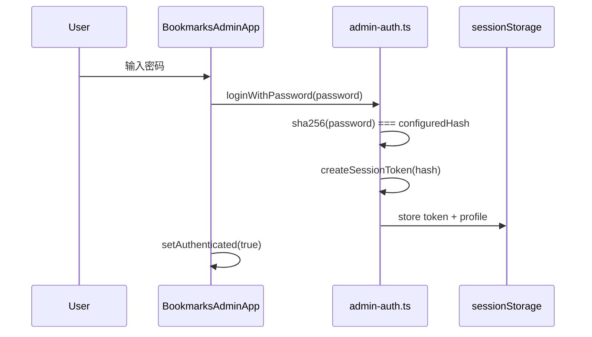

import { Steps } from '@astrojs/starlight/components';

管理端 `/admin/bookmarks/` 需要一层 **访问控制**：防止路人打开就改数据。在纯静态 + 本地 API 的架构下，采用 **前端密码门控 + Bearer Token** 方案。

## 威胁模型（务必读）

| 能力 | 本方案 | 说明 |
| --- | --- | --- |
| 防误触 / 防爬虫随便看 | ✅ | 需知密码才进 UI |
| 防懂技术的攻击者 | ❌ | 哈希在 bundle 里，Token 算法可见 |
| 生产环境写文件 | ❌ | API 显式拒绝非 DEV |

适合 **个人书签站**；若需多用户或敏感数据，应换真正后端鉴权。

## 密码配置

环境变量（`.env`）：

```txt title=".env"
PUBLIC_BOOKMARKS_ADMIN_HASH=<sha256-hex>
```

`scripts/dev-admin.mjs` 首次启动时：

1. 从 `.env.example` 复制 `.env`
2. 交互输入密码 → `crypto.createHash('sha256')` → 写入 hash
3. 启动 dev（`scripts/dev-bootstrap.mjs`），自动打开 `/admin/bookmarks/`

Hash 通过 Astro 的 `import.meta.env.PUBLIC_*` 注入管理端页面 props。

## 登录流程



核心逻辑在 `src/lib/bookmarks/admin-auth.ts`：

```ts
export async function createSessionToken(passwordHash: string): Promise<string> {
  const exp = Date.now() + 24 * 60 * 60 * 1000;
  const proof = await sha256(`${hash}:${exp}`);
  return btoa(JSON.stringify({ exp, proof }));
}
```

Token 含过期时间与 proof，proof = `SHA256(hash + exp)`。无独立 secret，安全性依赖 hash 本身不泄露。

## 首屏防闪屏

```ts
export function getInitialAdminSession(): AdminSessionState {
  if (!getAdminPasswordHash() || !hasValidSessionTokenSync()) {
    return { authenticated: false, userName: ADMIN_DISPLAY_NAME };
  }
  // token 未过期 → 乐观显示已登录，后台再 verify proof
  return { authenticated: true, userName: profile?.name ?? ADMIN_DISPLAY_NAME };
}
```

`hasValidSessionTokenSync` 只检查 `exp`，避免登录页一闪而过。挂载后 `useEffect` 再调用 `isAdminAuthenticated()` 完整校验，失败则清 session。

## 服务端 API 校验

开发态 API 不走 sessionStorage，而是读 `Authorization: Bearer <token>`：

```ts
// admin-auth.server.ts（Node crypto）
export function verifyAdminToken(token: string, passwordHash?: string): boolean {
  const { exp, proof } = JSON.parse(Buffer.from(raw, "base64").toString());
  const expected = crypto.createHash("sha256").update(`${hash}:${exp}`).digest("hex");
  return proof === expected && Date.now() <= exp;
}
```

客户端 `getAuthorizationHeader()` 在 fetch 前确保 token 仍有效。

## 页面门禁 UI

未登录时 `BookmarksAdminApp` 渲染 `AdminGateShell` + 登录 Card：

- 密码 Input、错误抖动反馈
- 链接到公开书签页 / 文档站
- 未配置 hash 时提示先运行 `vpr dev:admin`

已登录后渲染 `AdminApp` 主界面。

管理端 HTML 带 `<meta name="robots" content="noindex, nofollow" />`，减少被索引。

## 走通登录与 API

<Steps>

1. 删除 `.env` 中的 `PUBLIC_BOOKMARKS_ADMIN_HASH`，运行 `vpr dev:admin` 重新设密码

2. 打开 DevTools → Application → Session Storage，观察登录后 token 键名 `bookmarks-admin-session`

3. 登录后保存一次书签，在 Network 里查看 `POST /admin/api/save` 的 `Authorization` 头

4. 手动改 token 字符串，再点保存，应收到 `401 未授权`

</Steps>

## 线上行为

Build 后：

- 登录 UI 仍可用（hash 来自 CI 环境变量）
- `handleSave` / `handleRestore` 检查 `import.meta.env.DEV`，返回 403
- 用户可浏览、导出，但不能写回仓库

## 本章小结

- **PUBLIC hash + sessionStorage Token** 实现轻量门控
- 客户端与服务端 **各自** 校验 token 结构，API 不依赖 cookie
- 生产写操作被 DEV 守卫拦截，符合静态站模型
