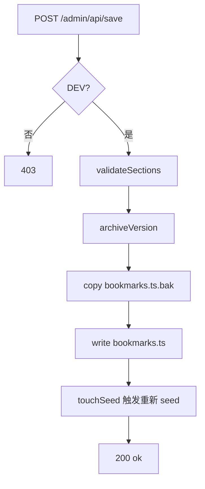

import { Steps } from '@astrojs/starlight/components';

最后一篇串起 **开发态 API**、**版本管理** 和 **部署工作流**——把本地改动能安全地推到线上静态站。

## 自定义 Astro Integration

`integrations/bookmarks-admin.ts` 注册 Vite 插件，在 dev server 上挂载中间件：

```ts
export function bookmarksAdmin(): AstroIntegration {
  return {
    name: "bookmarks-admin",
    hooks: {
      "astro:config:setup": ({ updateConfig }) => {
        updateConfig({ vite: { plugins: [bookmarksAdminApiPlugin()] } });
      },
    },
  };
}
```

中间件只处理 `/admin/api` 前缀：

| 方法 | 路径 | 作用 |
| --- | --- | --- |
| GET | `/admin/api/versions` | 列表；带 `?id=` 时返回单版本数据 |
| POST | `/admin/api/save` | 校验 → 归档 → 写 `bookmarks.ts` |
| POST | `/admin/api/restore` | 从版本文件恢复并写回 |

每个请求先 `requireAdminAuth(request)`，再执行业务。

## 保存管线



`validateSections` 拒绝空 section 或零书签，避免误操作清空站点。

`touchSeed` 更新 seed 相关文件时间戳，促使 dev 环境重新加载 DB。

## 版本目录结构

```text
db/data/versions/
├── manifest.json       # VersionEntry[] 元数据
├── 20260530-143022.json
└── …
```

`VersionEntry` 含 id、createdAt、section/card/bookmark 计数。超过 `MAX_VERSIONS`（40）时淘汰最旧条目。

版本 JSON 仅 dev 写入，可按需加入 `.gitignore`；manifest 是否提交取决于你是否想跨机器共享历史。

## dev 启动脚本

`scripts/dev-bootstrap.mjs` 负责 `.env` 初始化与启动 Astro dev；`dev-admin.mjs` / `dev-all.mjs` 在此基础上决定自动打开哪些路径。

1. 确保 `.env` 与密码 hash 存在
2. 启动 `astro dev`（默认 `http://localhost:4321`，前台与管理端同端口）
3. 解析 stdout 中 `Local http://localhost:…`，自动 `open` 目标 URL

`dev-all.mjs` 会打开主站与管理端两个标签页，适合日常编辑。

## 部署流程

<Steps>

1. 本地 `vpr dev:admin` 编辑书签，确认 UI 与导航页预览

2. 点击「保存到项目」，确认 `db/data/bookmarks.ts` diff 合理

3. 本地 `vpr build && vpr preview` 验证静态产物

4. Commit & push：

   ```bash
   git add db/data/bookmarks.ts
   git commit -m "update bookmarks: …"
   git push
   ```

5. GitHub Actions / Vercel / Netlify 自动 build，Astro DB seed 使用最新 TS 数据

6. 线上 `PUBLIC_BOOKMARKS_ADMIN_HASH` 在 CI 环境变量中配置（与本地相同 hash 则密码一致）

</Steps>

## 环境变量对照

| 变量 | 本地 | CI / 托管 |
| --- | --- | --- |
| `PUBLIC_BOOKMARKS_ADMIN_HASH` | `.env` | Secrets / Env Vars |

:::danger[不要提交 .env]
`.env` 应在 `.gitignore` 中。只提交 `.env.example` 模板。
:::

## 常见问题

**Q：保存后主站 dev 没更新？**  
重启 `vpr dev` 或确认 seed 被触发；检查 `bookmarks.ts` 语法是否有效。

**Q：线上能登录但保存失败？**  
预期行为。用导出 TS 或本地 dev 修改后再 push。

**Q：能否用 CMS 替代？**  
可以，但会失去「Git 即数据源」的 review 流程；本方案优先简单与可版本化。

## 可选扩展

- admin API 对接 GitHub Contents API（线上 PR 式保存）
- Vite middleware 换为 Serverless Function
- 书签导航页接入 Pagefind
