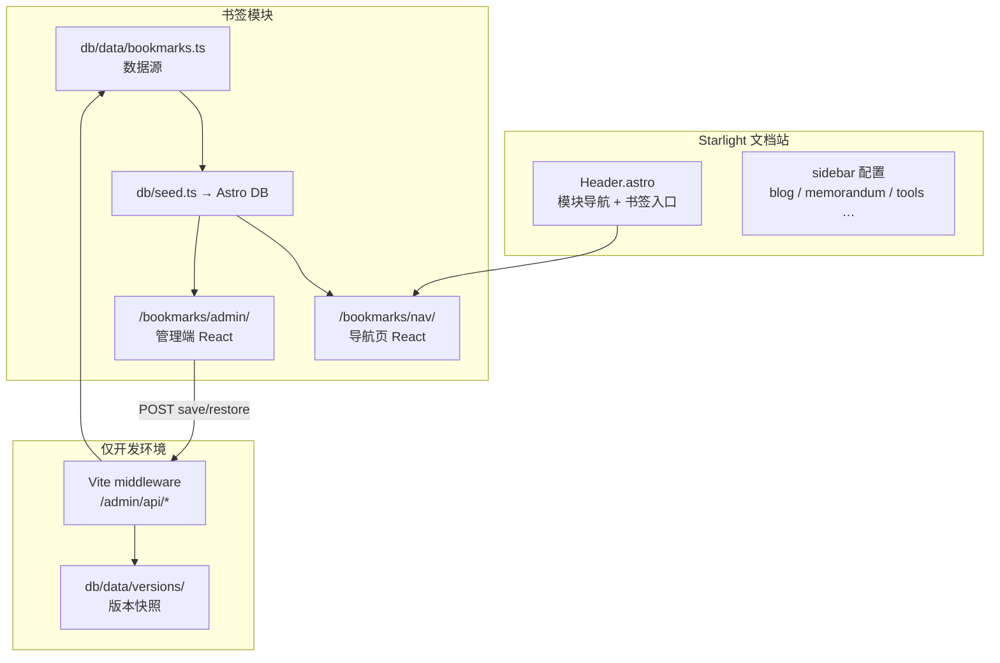

import { LinkCard, CardGrid } from '@astrojs/starlight/components';

`/bookmarks/nav/` 导航页与 `/bookmarks/admin/` 管理端的实现说明，按仓库内代码路径组织。

## 范围

- Astro 静态站中的 React 岛屿与 Starlight 并存
- Astro DB + `db/data/bookmarks.ts` 数据源与 seed
- 静态部署下 dev 中间件写回 TS、线上只读

## 架构

## 技术选型

| 层级 | 选型 | 在本项目中的角色 |
| --- | --- | --- |
| 框架 | Astro 6 + Starlight | 文档站 SSG、页面路由 |
| 交互 | React 19 | 书签导航页与管理端 UI |
| 样式 | Tailwind CSS 4 + shadcn 风格组件 | 统一主题、表单与对话框 |
| 数据 | Astro DB + `db/data/bookmarks.ts` | 构建时 seed，运行时查询 |
| 管理端 API | Vite dev middleware | 开发态写回 TS 文件 |

## 文章列表

<CardGrid stagger>
  <LinkCard title="01 · 整体架构与技术选型" href="/blog/bookmarks/01-architecture/" description="模块划分、数据流、静态站约束下的设计取舍" />
  <LinkCard title="02 · 数据模型与 Astro DB" href="/blog/bookmarks/02-data-layer/" description="三层 schema、seed 流程、查询组装" />
  <LinkCard title="03 · 书签导航页" href="/blog/bookmarks/03-public-page/" description="Astro 页面 + JSON 注水 + React 岛屿" />
  <LinkCard title="04 · 管理端鉴权" href="/blog/bookmarks/04-admin-auth/" description="密码哈希、Session Token、登录门控" />
  <LinkCard title="05 · 管理端 UI" href="/blog/bookmarks/05-admin-ui/" description="增删改、拖拽排序、对话框与未保存提示" />
  <LinkCard title="06 · 开发 API 与部署流程" href="/blog/bookmarks/06-dev-api-and-deploy/" description="Vite 中间件、版本历史、本地编辑到上线" />
</CardGrid>

局部文档见 [`src/bookmarks/README.md`](https://github.com/wwlight/wwlight.github.io/blob/main/src/bookmarks/README.md)。Starlight 配置见 [Astro Starlight 使用](/blog/starlight/)。
