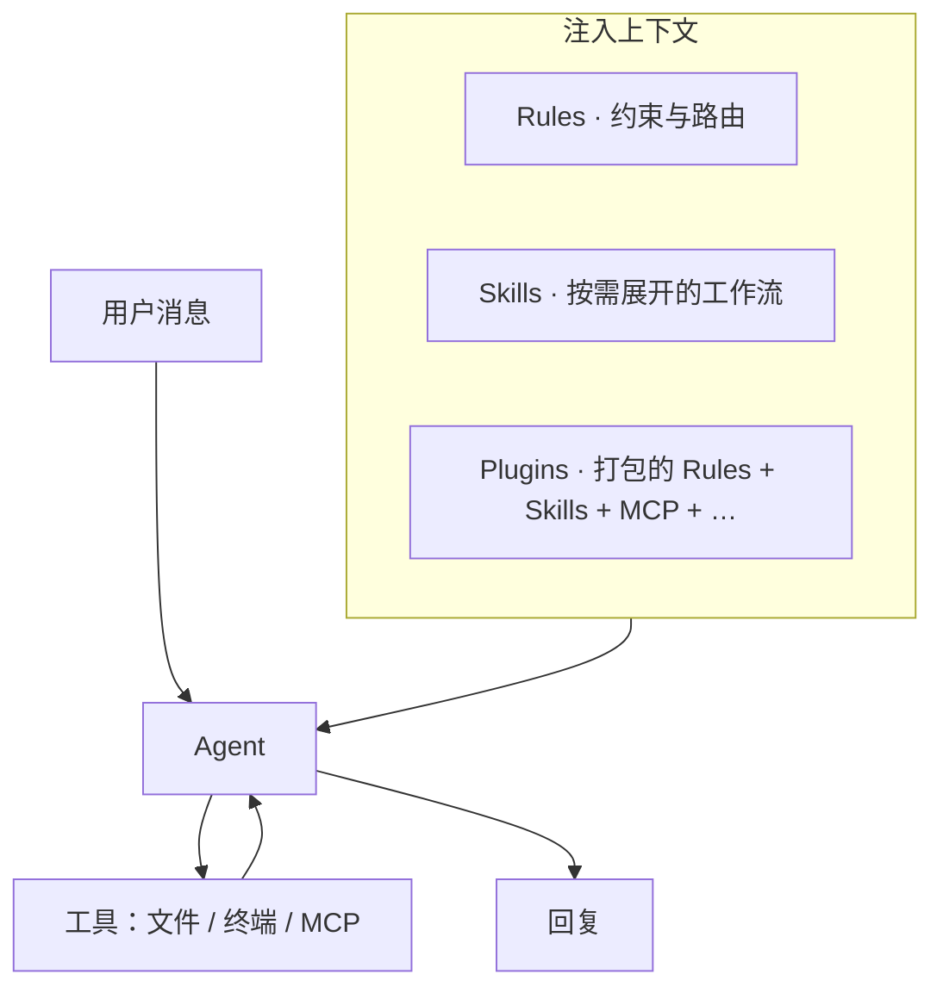
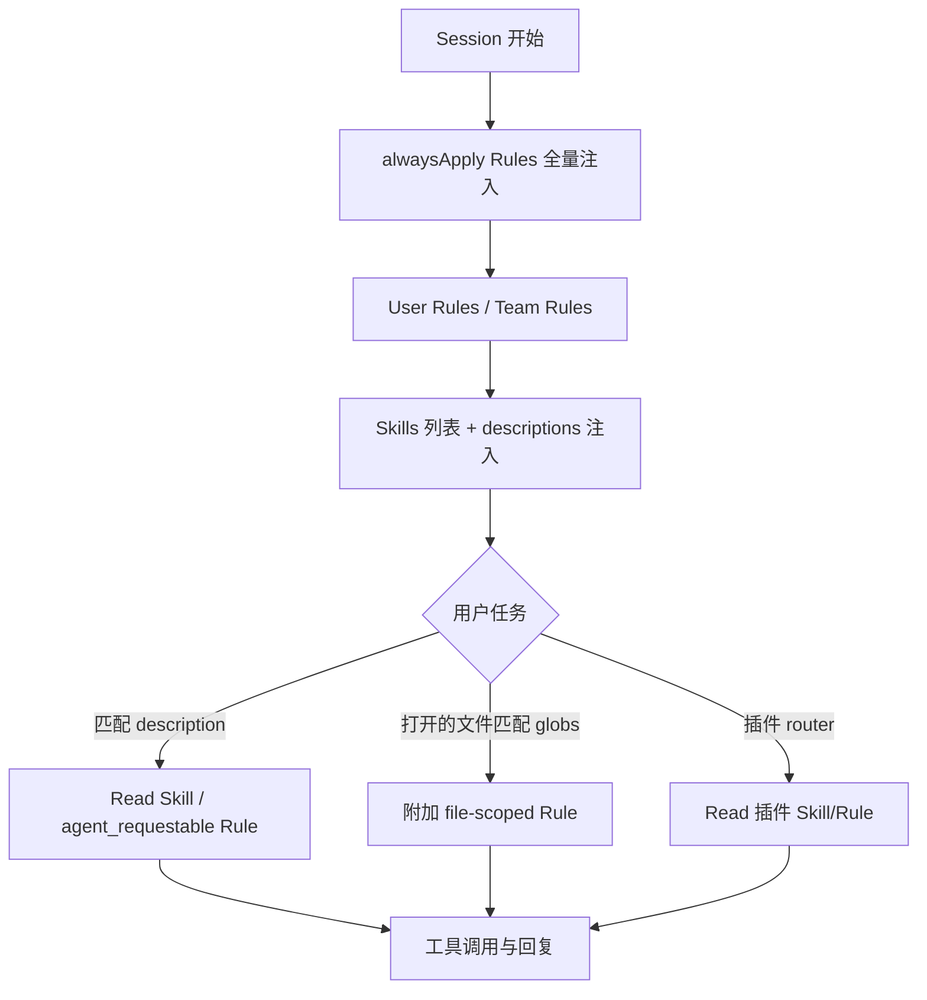

import { FileTree } from '@astrojs/starlight/components';

Cursor Agent 每次回复前，会把 **系统提示、Rules、Skills 摘要、打开的文件、对话历史** 等拼成一次请求的 **上下文（context）**。模型本身不「记住」你的仓库约定；约定写在外部文件里，由 Cursor 按规则注入。

本文说明这些机制的分工、存放位置，以及本仓库的实际布局。

## 基础概念

| 概念 | 含义 |
| --- | --- |
| **LLM** | 大语言模型。根据输入 token 序列预测下一个 token，没有持久记忆。 |
| **上下文窗口** | 单次请求能容纳的 token 上限。对话越长、注入的 Rules/Skills 越多，留给代码与推理的空间越少。 |
| **System prompt** | Cursor 在模型可见对话之前注入的指令层，包含产品行为、Rules、Skills 列表等。 |
| **Agent** | 能调用工具（读文件、改代码、跑终端、MCP 等）的多轮助手；Rules/Skills 约束其决策与写法。 |
| **Token** | 文本切分后的计费与长度单位。Skill 写得越长，占用上下文越多。 |

:::note[和「训练」的区别]
Rules / Skills **不会**微调模型权重；它们只是在每次会话里追加说明。改 `.mdc` 或 `SKILL.md` 后下一轮即生效，无需「重新训练」。
:::

## 三类扩展机制



### Rules

**作用**：持久约束——编码风格、项目约定、何时读哪份文档。

**格式**：`.cursor/rules/*.mdc`，YAML frontmatter + Markdown 正文。

| frontmatter | 行为（Cursor UI） |
| --- | --- |
| `alwaysApply: true` | **Always Apply** — 每轮对话都注入 |
| `alwaysApply: false` + `description` | **Apply Intelligently** — Agent 根据描述判断是否读取（运行时标签 `agent_requestable`） |
| `alwaysApply: false` + `globs` | **Apply to Specific Files** — 匹配文件在上下文中时附加 |
| 三者皆无 / 手动 | 通过 `@rule名` 手动引用 |

本仓库示例：

```yaml
---
description: wwlight 开发约定；每轮先读 dev skill
alwaysApply: true
---
```

`dev.mdc` 每轮生效，首动作是 Read `dev/SKILL.md`。Netlify 插件的 `netlify-skills-router.mdc` 同理：`alwaysApply: true` 做路由，各主题 rule（如 `netlify-functions.mdc`）带 `description`、`alwaysApply: false`，按需加载。

**Rules 优先级（官方文档）**：冲突时 **Team Rules → Project Rules → User Rules**。Team 在 Cursor 仪表盘配置；User 在 Settings → Rules，且 **不** 作用于 Inline Edit（Cmd/Ctrl+K）。

### Skills

**作用**：可复用的 **工作流与领域知识**——何时读哪些文件、步骤清单、输出模板。比 Rule 更适合长文档与渐进阅读（`SKILL.md` + `references/`）。

**格式**：目录 + `SKILL.md`，frontmatter 至少含 `name`、`description`。

```yaml
---
name: dev
description: wwlight.github.io development — routes, vpr scripts, refactoring, Tailwind v4, docs.
---
```

Agent 启动时看到 Skills **列表与 description**；相关任务时 **Read 整个 SKILL.md**（及链接的子文件）。也可手动 `/skill-name` 或 `@skill` 触发。

`disable-model-invocation: true`（create-skill 默认值）时仅显式调用，不自动匹配 description。

**与 Rule 的分工（经验法则）**

| 放 Rule | 放 Skill |
| --- | --- |
| 短、硬约束（alwaysApply） | 长流程、多文件引用 |
| 「必须先做 X」 | 「做 X 时读 Y、再 Z」 |
| 路由到 Skill（如 Netlify router） | 具体 API、命令表、路径表 |

Cursor 提供 **migrate-to-skills**：带 `description`、无 `globs`、非 `alwaysApply` 的 Rule 可迁为 Skill，减少常驻 token。

### Plugins

**作用**：可安装的扩展包，常见内容：

| 组件 | 说明 |
| --- | --- |
| Rules | `.mdc` 持久指引 |
| Skills | `SKILL.md` 工作流 |
| MCP Servers | 外部工具（如 Figma MCP） |
| Agents / Commands / Hooks | 子代理、斜杠命令、事件钩子 |

安装后缓存于 `~/.cursor/plugins/cache/...`。本环境示例：Netlify（21 条 topic rules + skills）、Figma（skills + MCP）、shadcn、GSAP 等。

Plugin 的 Rule 与项目 `.cursor/rules/` **并存**；官方未给出细粒度 precedence，实践中 **项目 alwaysApply Rule + 插件 router** 常同时存在，Agent 按描述按需 Read 插件内 Skill/Rule。

## 全局 vs 项目（局部）

### Rules

| 位置 | 范围 |
| --- | --- |
| `.cursor/rules/` | **项目**，可入库共享 |
| Cursor Settings → Rules | **用户**，跨项目；Agent Chat 有效 |
| Team dashboard | **组织** |

### Skills

Cursor 与 [Agent Skills 开放标准](https://cursor.com/docs/skills) 均支持多路径：

| 位置 | 范围 | 典型来源 |
| --- | --- | --- |
| `.cursor/skills/` | 项目 | 手写、`create-skill` 推荐 |
| `.agents/skills/` | 项目 | `npx skills add`（Skills CLI 默认项目路径） |
| `~/.cursor/skills/` | 用户全局 | 个人 skill |
| `~/.agents/skills/` | 用户全局 | CLI 全局安装 |

**不要**在 `~/.cursor/skills-cursor/` 下创建 skill — 该目录为 Cursor 内置 skill 专用。

### Subagents（补充）

与 Skills 不同，自定义子代理路径为：

| 位置 | 优先级 |
| --- | --- |
| `.cursor/agents/` | 高（项目） |
| `~/.cursor/agents/` | 低（用户） |

同名 subagent **项目覆盖用户**。

## `.agents/skills` 与 `.cursor/skills`

两者在 Cursor 中均为 **项目级 Skill 发现路径**，运行时等价；差异主要在 **约定与工具链**：

- **`.cursor/skills/`** — 本仓库手写：`dev` 等
- **`.agents/skills/`** — Skills CLI 安装的项目 skill（本仓可为空；`find-skills` 等可装全局 `~/.agents/skills/`）

<FileTree>

- .cursor/
  - rules/
    - dev.mdc
  - skills/
    - dev/SKILL.md
    - dev/reference.md
    - dev/tailwindcss.md
- ~/.cursor/rules/
  - karpathy-guidelines.mdc

</FileTree>

### 优先级与同名 Skill

**官方未说明** 当 `.agents/skills/foo` 与 `.cursor/skills/foo` 同名时的覆盖顺序；也 **未说明** 项目 skill 与用户 `~/.cursor/skills/` 的优先级。

可操作的实践：

1. **避免同名** — 项目内 CLI 安装与手写不要撞名。
2. **分层职责** — alwaysApply Rule 指向 **单一入口** skill（本仓库：`dev`）。
3. **lockfile** — CLI 全局安装记录在 `~/.agents/.skill-lock.json`；`vpx skills update` 升级（本仓用 Vite+ 时以 `vpx` 代替 `npx`）。

## 一次对话中的加载顺序（概念模型）

官方未发布完整算法；结合文档与行为，可理解为：



**Token 竞争**：alwaysApply 越多、Skill 正文越长，留给 diff 与推理的空间越小。Karpathy 类准则、项目 router 适合 Rule；大段 API 表、重构清单适合 Skill + 按需 Read。

## 本仓库的分层设计

| 层 | 文件 | 职责 |
| --- | --- | --- |
| 行为准则 | `~/.cursor/rules/karpathy-guidelines.mdc`（全局 alwaysApply） | 最小改动、先澄清再写码 |
| 项目路由 | `dev.mdc`（alwaysApply） | 每轮 Read `dev/SKILL.md` |
| 项目知识 | `.cursor/skills/dev/` | `reference.md`：路径/路由、重构、反模式；`tailwindcss.md` |
| CLI 扩展 | `~/.agents/skills/find-skills` 等（全局） | 发现/安装社区 skill |
| 部署平台 | Netlify plugin rules/skills | Functions、Database、deploy 等 |

:::tip[写新 Skill 时]
`description` 写清 **做什么 + 什么任务触发**（第三人称）；正文保持短，细节放 `references/` 或模块 README，需要时再 Read。
:::

## 与 User Rules 的关系

Settings 里的 **User Rules**（如「只在我要求时 commit」）与项目 Rule 叠加。冲突时以 **Team → Project → User** 为准；同层内尽量写不重叠的职责。

Inline Edit 不读 User Rules — 若某约束必须全局生效，应放到项目 `.mdc` 的 `alwaysApply: true` 或 Team Rules。

## 延伸阅读

- [Cursor · Rules](https://cursor.com/docs/context/rules)
- [Cursor · Skills](https://cursor.com/docs/skills)
- [Cursor · Plugins](https://cursor.com/docs/plugins)
- 本仓库：[CURSOR.md](https://github.com/wwlight/wwlight.github.io/blob/main/CURSOR.md)（`.cursor/` 速查）
