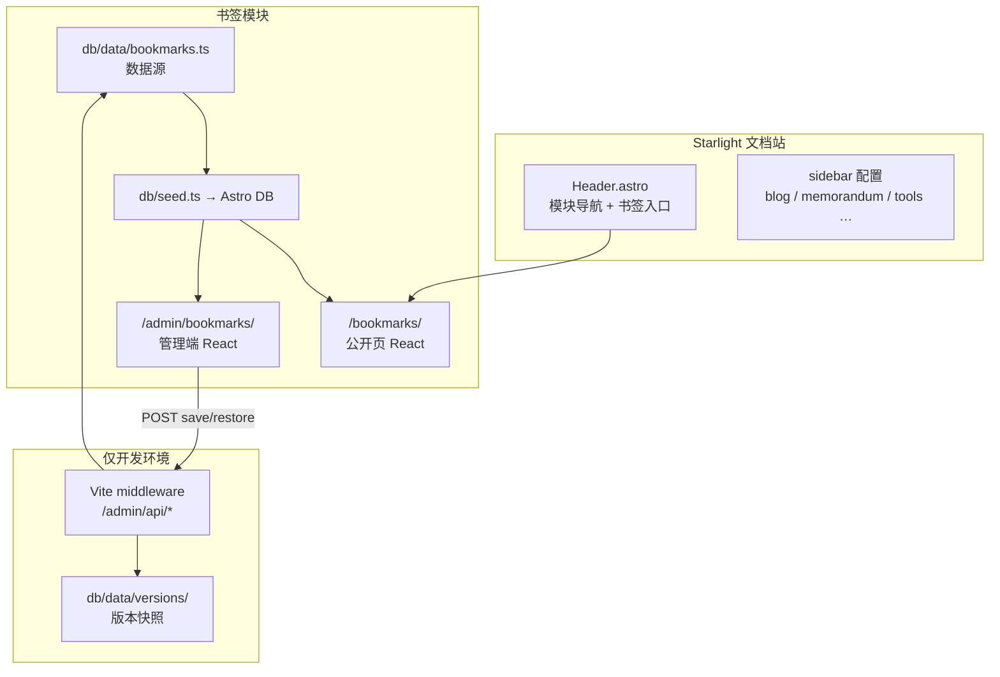

import { LinkCard, CardGrid } from '@astrojs/starlight/components';

本系列记录 [wwlight.github.io](https://github.com/wwlight/wwlight.github.io) 站点中 **书签导航**（`/bookmarks/`）与 **本地管理端**（`/admin/bookmarks/`）的设计与实现。目标不是抽象讲概念，而是按真实代码路径，从 0 到 1 走一遍搭建流程。

## 你会学到什么

- 在 Astro 静态站里接入 **React 岛屿**，同时保留 Starlight 文档站
- 用 **Astro DB** 管理结构化书签数据，并以 TypeScript 文件作为「可提交的数据源」
- 设计 **双层导航**：Starlight 侧边栏 + 顶栏模块切换
- 在 **纯静态部署** 约束下，实现「本地可编辑、线上只读」的管理端

## 整体架构一览



## 技术选型

| 层级 | 选型 | 在本项目中的角色 |
| --- | --- | --- |
| 框架 | Astro 6 + Starlight | 文档站壳层、SSG、页面路由 |
| 交互 | React 19 | 书签公开页与管理端 UI |
| 样式 | Tailwind CSS 4 + shadcn 风格组件 | 统一主题、表单与对话框 |
| 数据 | Astro DB + `db/data/bookmarks.ts` | 构建时 seed，运行时查询 |
| 管理端 API | Vite dev middleware | 开发态写回 TS 文件 |

## 系列目录

<CardGrid stagger>
  <LinkCard title="01 · 整体架构与技术选型" href="/blog/01-architecture/" description="模块划分、数据流、静态站约束下的设计取舍" />
  <LinkCard title="02 · 站点导航" href="/blog/02-site-navigation/" description="Starlight sidebar、顶栏 ModuleNav、书签入口" />
  <LinkCard title="03 · 数据模型与 Astro DB" href="/blog/03-data-layer/" description="三层 schema、seed 流程、查询组装" />
  <LinkCard title="04 · 公开书签页" href="/blog/04-public-page/" description="Astro 页面 + JSON 注水 + React 岛屿" />
  <LinkCard title="05 · 管理端鉴权" href="/blog/05-admin-auth/" description="密码哈希、Session Token、登录门控" />
  <LinkCard title="06 · 管理端 UI" href="/blog/06-admin-ui/" description="增删改、拖拽排序、对话框与未保存提示" />
  <LinkCard title="07 · 开发 API 与部署流程" href="/blog/07-dev-api-and-deploy/" description="Vite 中间件、版本历史、本地编辑到上线" />
</CardGrid>

## 前置要求

- Node.js **24**（见仓库根目录 `.node-version`）
- 熟悉 TypeScript、React 基础
- 已 clone 仓库并执行 `vp i` 安装依赖

## 快速体验

```bash
vpr dev           # 本地开发 http://localhost:4321
vpr dev:admin     # 同上，就绪后自动打开 /admin/bookmarks/
vpr dev:all       # 同上，自动打开主站与管理端
```

建议按目录顺序阅读。
