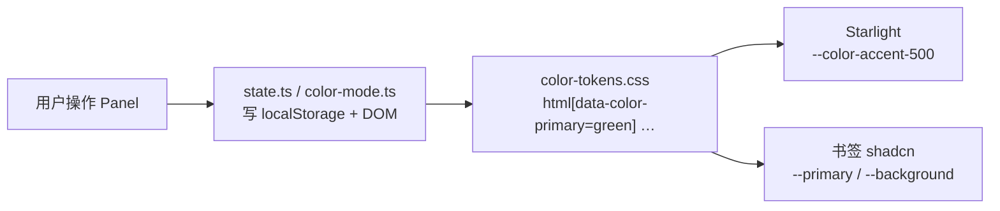

import { Steps, FileTree } from '@astrojs/starlight/components';

站点同时存在 **Starlight 文档壳**（`--sl-color-*`）和 **书签 React 壳**（shadcn `--primary` / `--background`）。主题系统的目标是：一套用户偏好，两种 CSS 消费路径，全站 DOM 状态一致。

## 状态模型

运行时状态分两层，都写在 `document.documentElement`：

| 层 | data 属性 | 存储键 | 模块 |
| --- | --- | --- | --- |
| 明暗 | `data-theme` + `.dark`/`.light` | `wwlight:color-mode` | `color-mode/` |
| 配色 | `data-color-primary`、`data-color-neutral`、`data-radius` | `wwlight:color-primary` 等 | `customizer/` |

legacy `data-color-theme` 与 `data-color-primary` 同步，供旧选择器；全库清理前勿删。



CSS 不读 `localStorage`；只读 DOM。首屏内联脚本在 CSS 加载前把 storage 灌进 DOM，避免闪烁。

## 目录职责

<FileTree>

- src/theme/
  - color-mode/ — 明暗偏好、`setThemeWithTransition`
  - customizer/ — Primary / Neutral / Radius 状态与 `ThemeSurface` 样式
  - site/ — `syncSiteThemeFromStorage`、跨标签 `storage` 订阅
  - components/ — Panel、Trigger、Provider、Starlight 专用 Popover
  - styles/ — `color-tokens.css`（生成）、`radius.css`、`view-transition.css`
  - scripts/ — `init.inline.js`（生成）
  - index.ts — `@/theme` 桶导出

</FileTree>

数据源与生成脚本在 `scripts/`：

| 文件 | 产出 |
| --- | --- |
| `color-themes.data.mjs` | 主题定义 + `buildColorThemesCss()` |
| `generate-color-theme-css.mjs` | `styles/color-tokens.css`、`customizer/options.json` |
| `generate-theme-init.mjs` | `scripts/init.inline.js` |

改 `color-themes.data.mjs` 后执行 `vpr generate:color-themes`；改 storage 键或默认值后执行 `vpr generate:theme-init`。勿手改生成物。

## 技术选型

### 为何用 html data 属性而非 CSS class 组合

Primary × Neutral × Radius 组合量大。用 `html[data-color-primary='green'][data-color-neutral='slate']` 分段声明变量，生成器按维度展开，避免 class 笛卡尔积爆炸。

### 为何生成 CSS 而非运行时算色

- 构建期校验（`validateColorThemesCss` 检测循环引用）
- 浏览器只做选择器匹配，无 JS 色板计算
- Starlight 与 shadcn 共用同一份 `color-tokens.css`

### 默认值

对齐 [Nuxt UI Design System](https://ui.nuxt.com/docs/getting-started/theme/design-system)：

| 项 | 默认 |
| --- | --- |
| Primary | `green` |
| Neutral | `slate` |
| Radius | `0.25` |
| Color Mode | `system` |

Primary 在亮色取 Tailwind `500`、暗色取 `400`；`black` 的 `--primary` 亮 `zinc-950` / 暗 `white`（见 `color-tokens.css`）。Panel / 触发器 black 色块用 `--theme-primary-swatch-black`（暗色反转为 white，见 `customizer-trigger.css`）。

### 首屏脚本注入点

| 表面 | 注入位置 |
| --- | --- |
| Starlight | `astro.config.mjs` → `starlight.head` |
| 书签 / 管理端 | `src/bookmarks/nav/entry.astro`、`admin/entry.astro` 内联 `<script>` |

Starlight 与书签页不共享 layout，两处都要挂同一份 `init.inline.js?raw`。

### 对外 API

```ts
import {
  setThemePreference,
  setThemeCustomizerState,
  syncSiteThemeFromStorage,
  subscribeSiteThemeStorage,
} from '@/theme'
```

组件入口：

- `@/theme/components/customizer/ColorThemeSelect.astro` — Starlight 静态触发按钮
- `@/theme/components/customizer/ColorThemePicker` — 书签 / 管理端 React 触发器别名

## 复刻检查清单

<Steps>

1. 复制 `src/theme/`、`scripts/color-themes.data.mjs`、`scripts/generate-*.mjs`、`src/lib/site-storage.keys.mjs`
2. `global.css` / 书签 CSS 入口 `@import '../theme/styles/index.css'` 与 `shadcn-theme.css`
3. `astro.config.mjs` 的 `starlight.head` 注入 `init.inline.js`
4. 独立 Astro 页面（非 Starlight）自行内联同一 init 脚本
5. 运行 `vpr generate:color-themes` 与 `vpr generate:theme-init`
6. Starlight 顶栏挂 `ColorThemeSelect` + `ThemeCustomizerPopover client:only="react"`
7. 书签根组件包 `ThemeProvider`，工具栏挂 `ColorThemePicker`

</Steps>

## 已知限制

- Color Mode 面板同页用 React state；跨标签靠 `subscribeSiteThemeStorage`，无独立 color-mode store
- `radius.css` 内 Starlight 组件圆角需手动补选择器

细节见 [`src/theme/README.md`](https://github.com/wwlight/wwlight.github.io/blob/main/src/theme/README.md)。
