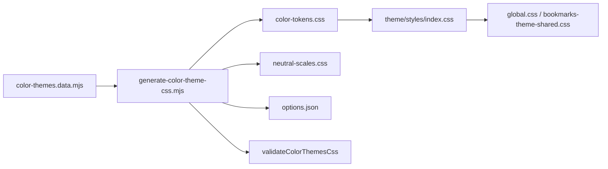

## 数据源

`scripts/color-themes.data.mjs` 导出：

| 导出 | 用途 |
| --- | --- |
| `PRIMARY_THEMES` | 18 chroma + `black` |
| `NEUTRAL_THEMES` | 9 项：Tailwind 五档 + `taupe` / `mauve` / `mist` / `olive`（生成独立 oklch 色阶，见 `neutral-scales.css`） |
| `RADIUS_OPTIONS` | `0` … `0.5` rem |
| `buildColorThemesCss()` | 生成完整 `color-tokens.css` |
| `buildColorThemesJson()` | 生成 `customizer/options.json` 供 Panel 读取 |

生成命令：

```bash
vpr generate:color-themes
```

产出：

- `src/theme/styles/neutral-scales.css`（`taupe` / `mauve` / `mist` / `olive` 的 `@theme` 色阶）
- `src/theme/styles/color-tokens.css`
- `src/theme/customizer/options.json`

## 生成流水线



`validateColorThemesCss` 在写入前检查：

- `--color-*` 自引用循环
- Neutral 不得 `gray → gray` 空映射
- Primary 不得 `accent → accent` 空映射

## Primary：双轨输出

每个 primary id 生成三类块：

### 1. Starlight accent 色阶

```css
html[data-color-primary='green'] {
  --color-accent-50: var(--color-green-50);
  /* … */
  --color-accent-950: var(--color-green-950);
}
```

Starlight 侧栏、链接、搜索高亮读 `--sl-color-accent-*`，底层由 Tailwind 的 `--color-accent-*` 映射而来（`@astrojs/starlight-tailwind`）。

### 2. shadcn primary / ring

```css
html[data-color-primary='green'] {
  --primary: var(--color-green-500);
  --primary-foreground: var(--color-white);
  --ring: var(--color-green-500);
}

html.dark[data-color-primary='green'],
html[data-theme='dark'][data-color-primary='green'] {
  --primary: var(--color-green-400);
  --primary-foreground: var(--color-green-950);
  --ring: var(--color-green-400);
}
```

书签页 Button、Popover、表单环形色读 `--primary`；`shadcn-theme.css` 将其桥接到 Tailwind：

```css
@theme inline {
  --color-primary: var(--primary);
  --color-ring: var(--ring);
}
```

### 3. Black

`black` 的 accent 映射 `zinc`；`tailwindPrimaryTokens` 亮 `--color-zinc-950`、暗 `--color-white`（写入 `--primary` / `--ring`）。Panel 预览色块不能写 `var(--color-*-500)`，也不能在未选中时用 `--primary`——`options.json` 的 `swatch` 与 `customizer-trigger.css` 统一为 `--theme-primary-swatch-black`（暗色同为 white）。顶栏已选 black 时触发器色块仍走 `var(--primary)`，与运行时一致。

## Neutral：Tailwind 灰阶 + 扩展色阶

Neutral 共 9 项：Tailwind 内置五档 + 4 个扩展名（`taupe` / `mauve` / `mist` / `olive`）。扩展色由生成器从内置 scale 的 **L 曲线** 推导 oklch，hue / chroma 在 `CUSTOM_NEUTRAL_SCALE_CONFIG` 配置（如 `olive` hue 136），写入 `neutral-scales.css` 的 `@theme --color-{name}-*`；表面语义由 `tailwindNeutralSurfaceTokens()` 按 step 映射。Panel swatch 为 `var(--color-{scale}-500)`。`grayScale()` 把 `--color-gray-*` 重映射到所选 scale，供 Starlight `--sl-color-gray-*` 链使用。

暗色表面关键 step（`tailwindNeutralSurfaceTokens(scale, 'dark')`）：

| token | step |
| --- | --- |
| `--background` | `{scale}-950` |
| `--card` | `{scale}-900` |
| `--border` / `--input` | `{scale}-700` |

书签 `.bookmark-card` 读 `--card` / `--border`，随 neutral 切换（见 04 篇）。

Neutral **不**改写 Starlight 的 `--sl-color-gray-*`；文档站灰阶仍由 Starlight 主题控制，只有 accent 随 primary 变。

## Radius

```css
html[data-radius='0.25'] {
  --radius: 0.25rem;
}
```

`radius.css` 提供 `theme-r-sm` … `theme-r-xl` 工具类，并覆盖 Starlight 搜索框、LinkCard、sidebar 链接等硬编码圆角。

## 触发器标签回退

生成器末尾写入 `[data-theme-customizer-trigger] [data-part='label']:empty::after` 规则：按 `html[data-color-primary]` 显示 Primary 名称。Starlight 的 `TriggerButton.astro` 标签留空，靠 CSS 显示，避免 hydration 前文案缺失。

React 触发器（书签）在客户端读 `PRIMARY_THEMES` 直接渲染 label；色块由 `customizer-trigger.css` 统一（`var(--primary)`，black 已选时用 `--theme-primary-swatch-black`）。

## Astro（Starlight）与书签 token 消费对照

| 变量族 | 谁写入 | Starlight 消费 | 书签消费 |
| --- | --- | --- | --- |
| `--color-accent-*` | primary 块 | 侧栏 accent、链接强调 | 一般不直接用 |
| `--primary` / `--ring` | primary 块 | BackToTop 等 shadcn 组件 | Button、Input、Picker |
| `--background` 等 | neutral 块 | 仅 `@/styles/global.css` 引入的 shadcn 岛 | 整页背景、`.bookmark-card`（`--card` / `--border`） |
| `--radius` | radius 块 | `custom.css` 模块导航、`radius.css` 覆盖 SL 组件 | `theme-r-*`、shadcn `@radius-*` |
| `data-theme` | color-mode | Starlight 暗色、`mermaid autoTheme` | `@custom-variant dark` |

样式入口：

```text
Starlight:  custom.css + global.css → shadcn-theme.css + theme/styles/index.css
书签:       bookmarks-theme-shared.css → 同上（无 @astrojs/starlight-tailwind）
```

书签页不加载 Starlight 层，因此 **文档站视觉** 靠 `--sl-color-*` + accent 映射，**书签视觉** 靠 shadcn 语义变量；两者由同一份 `color-tokens.css` 按 data 属性切换。

## 扩展 Primary / Neutral

1. 在 `color-themes.data.mjs` 的 `CHROMA_PRIMARY_SCALES` 或 `NEUTRAL_BUILTIN_SCALES` / `NEUTRAL_CUSTOM_SCALES` 追加 id；自定义 neutral 须在 `CUSTOM_NEUTRAL_SCALE_CONFIG` 补推导规则
2. `vpr generate:color-themes`（产出 `neutral-scales.css` + `color-tokens.css` + `options.json`）
3. `vpr generate:theme-init`（init 脚本内嵌 id 白名单）
4. 在 `trigger-classes` 的 CSS 回退块会自动包含新 primary（由生成器追加）

勿直接编辑 `color-tokens.css` 或 `options.json`。
