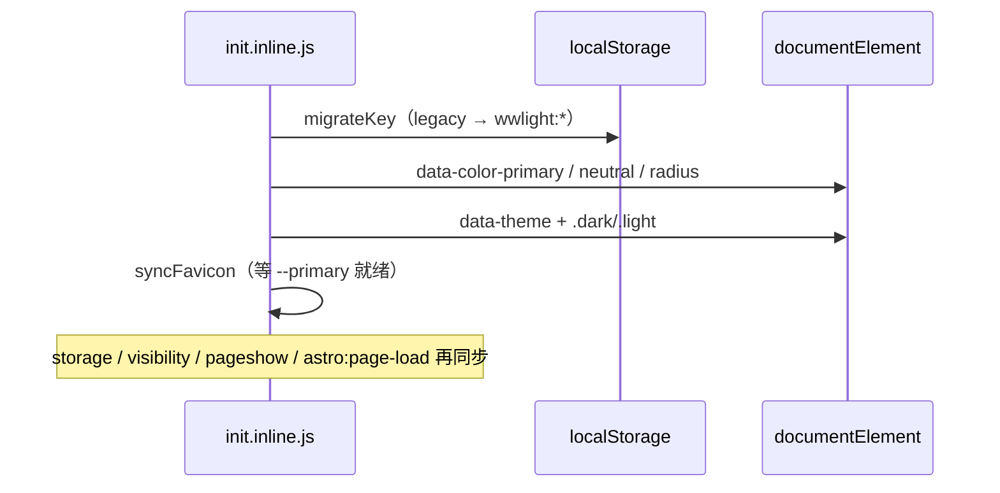

## 明暗模式状态机

`src/theme/color-mode/color-mode.ts` 定义：

| 类型 | 值 |
| --- | --- |
| `ThemePreference` | `light` \| `dark` \| `system` |
| `ResolvedTheme` | `light` \| `dark` |

`system` 解析为 `matchMedia('(prefers-color-scheme: dark)')` 结果。写入 DOM：

```ts
root.dataset.theme = theme
root.classList.remove('light', 'dark')
root.classList.add(theme)
```

`syncSiteFavicon()` 随主题与 primary 更新 SVG favicon（读 `var(--primary)`  computed color）。

## 首屏：init.inline.js

生成源：`scripts/generate-theme-init.mjs`，读取 `src/lib/site-storage.keys.mjs` 的键名与 legacy 映射。

IIFE 在 `<head>` 最早执行：



与运行时 TS 的分工：

| 职责 | init.inline.js | color-mode.ts / state.ts |
| --- | --- | --- |
| 首屏 DOM | ✓ |  hydration 后可选再 sync |
| legacy 迁移 | ✓ | `migrateAllLegacyStorageKeys()` 重复兜底 |
| View Transition | ✗ | `setThemeWithTransition` |
| favicon | ✓（rAF 重试） | `applyThemeCustomizerState` 也会调 |

书签页与 Starlight 各注入同一份脚本；Starlight 另在 `astro:page-load` 时 resync（客户端导航）。

## Storage 键

定义于 `src/lib/site-storage.keys.mjs`：

| 键 | 默认 legacy |
| --- | --- |
| `wwlight:color-mode` | `starlight-theme` |
| `wwlight:color-primary` | `color-primary`、`color-theme` |
| `wwlight:color-neutral` | `color-neutral` |
| `wwlight:theme-radius` | `theme-radius` |

改前缀只改 `SITE_STORAGE_PREFIX`，再 `vpr generate:theme-init`。

## 全站同步 API

`src/theme/site/sync.ts`：

```ts
export function syncSiteThemeFromStorage() {
  syncStoredTheme()           // color-mode
  syncStoredThemeCustomizerState()  // primary / neutral / radius
  syncSiteFavicon()
}

export function subscribeSiteThemeStorage(onChange: () => void)
```

`storage` 事件仅在**其他标签页**写入时触发；同页 Panel 用 `flushSync` + 直接写 DOM。

订阅方：

- `ThemeCustomizerPanel` — 刷新 Color Mode 选中态
- `ThemeProvider` — 书签 React 树
- `ThemeCustomizerTrigger` — 触发器 label / swatch

额外兜底：`visibilitychange`、`pageshow`（bfcache）、init 内 `setTimeout(syncFromStorage, 0)`。

## View Transition 圆形揭示

`setThemeWithTransition(next, { clientX, clientY })`：

1. 检测 `document.startViewTransition` 与 `prefers-reduced-motion`
2. 相同 resolved theme 或不可动画 → 直接 `applyResolvedTheme`
3. 否则 `startViewTransition(() => applyResolvedTheme(next))`
4. 以点击点为圆心，`clip-path: circle()` 动画 old/new 伪元素

`src/theme/styles/view-transition.css` 控制 z-index：

- 切 **dark**：old 层在上，圆形内收
- 切 **light**：new 层在上，圆形外扩

常量与 TS 对齐：`THEME_TRANSITION_DURATION = 400`、`ease-in-out`。

Color Mode 面板三按钮调用 `setThemePreferenceWithTransition`；书签 `ThemeProvider.setTheme` 可选传入 `MouseEvent` 走同一动画。

## 配色状态（customizer/state.ts）

与明暗并行、独立 storage 键：

```ts
root.dataset.colorPrimary = state.primary
root.dataset.colorNeutral = state.neutral
root.dataset.radius = state.radius
root.dataset.colorTheme = state.primary  // legacy
```

`useSyncExternalStore(subscribeThemeCustomizerState, getDocumentThemeCustomizerState)` 供 Panel 订阅 DOM 快照；SSR 回退 `getServerThemeCustomizerStateSnapshot()`（默认 green / slate / 0.25）。

随机 / 重置：

- `randomThemeCustomizerState` — 各维随机非当前值
- `resetThemeCustomizerToDefaults` — 配色 + Panel 内 Color Mode 一并回 `system`

## Mermaid 与 Shiki

- `astro.config.mjs`：`mermaid({ autoTheme: true })` 读 `data-theme`
- Markdown Shiki：`github-light` / `github-dark`，与站点 preference 独立（代码块不随 primary 变）

## 调试要点

| 现象 | 检查 |
| --- | --- |
| 首屏闪白/闪错色 | init 是否在 CSS 前；书签页是否注入 script |
| 跨页 primary 不一致 | `syncSiteThemeFromStorage` 是否在 Popover mount 时调用 |
| 动画不生效 | Safari 版本、`prefers-reduced-motion`、是否传入 click 坐标 |
| favicon 不变色 | `--primary` 是否已定义；console 无 40 次 rAF 后仍失败 |
