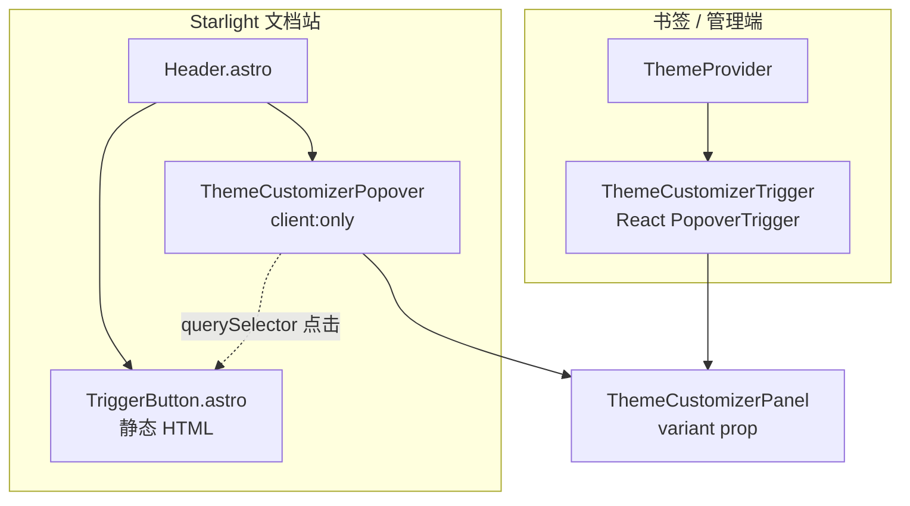

Starlight 与书签共用 `ThemeCustomizerPanel`，但 **触发器形态**、**Popover 挂载**、**面板 chrome 色** 按表面区分。类型为 `ThemeSurface = 'starlight' | 'bookmarks'`（`trigger-classes.ts`）。

## 集成对照



| 项 | Starlight | 书签 / 管理端 |
| --- | --- | --- |
| 触发器 | `ColorThemeSelect.astro` → `TriggerButton.astro` | `ColorThemePicker` → `Trigger.tsx` |
| Popover | 独立 island，锚定静态按钮 | 内嵌于 Trigger |
| 标签文案 | CSS `:empty::after` 回退 | React 读 `PRIMARY_THEMES` |
| 明暗 Context | 无 `ThemeProvider` | `ThemeProvider` 包根组件 |
| variant | `starlight` | `bookmarks`（默认） |

## 为何 Starlight 拆静态按钮 + React Popover

Starlight Header 以 Astro 为主。若整颗触发器都是 React island，hydration 前后按钮位置/文案可能错位。当前做法：

1. `TriggerButton.astro` 输出纯 HTML + `data-theme-customizer-trigger`
2. `ThemeCustomizerPopover` mount 后 `querySelectorAll` 绑定 click，用 `PopoverAnchor virtualRef` 对齐
3. 色块 `background-color: var(--primary)`（`customizer-trigger.css`）；label 留空靠生成 CSS 填文案

`Header.astro` 片段：

```astro
<ColorThemeSelect />
<ThemeCustomizerPopover client:only="react" variant="starlight" />
```

## 书签侧

`NavBookmarksPage.tsx` / `BookmarksAdmin.tsx`：

```tsx
<ThemeProvider>
  {/* … */}
  <ColorThemePicker />  {/* variant 默认 bookmarks */}
</ThemeProvider>
```

`ThemeProvider` 职责：

- mount 时 `syncSiteThemeFromStorage()`
- 订阅 `subscribeSiteThemeStorage` 更新 preference state
- `system` 时监听 `prefers-color-scheme` 变化
- 暴露 `setTheme` / `toggleTheme`（可选 View Transition）

Starlight 文档页不包 Provider；明暗完全靠 init + Panel 的 Color Mode 区。

## 定制器 UI token（`customizer-ui.css`）

触发器、Popover、Panel 选项共用 `--theme-ui-*` 语义变量；Starlight / 书签差异写在 `[data-theme-surface='starlight'|'bookmarks']`，由触发器与 Popover 根节点挂载 `data-theme-surface={variant}`。

`trigger-classes.ts` 只引用 `--theme-ui-*` token（如 `bg-(--theme-ui-trigger-bg)`）。Panel 内 Primary / Neutral / Radius 选项的 hover / 选中在 `surface.ts`：

| 表面 | 未选中 hover | 选中 |
| --- | --- | --- |
| `starlight` | `hover:bg-(--sl-color-gray-6)` | accent 边框 + `bg-(--sl-color-accent-low)` |
| `bookmarks` | `hover:bg-accent/50` | `border-primary bg-primary/10` |

扩展新表面：

1. 扩展 `ThemeSurface` 联合类型
2. 在 `customizer-ui.css` 增加 `[data-theme-surface='…']` token 块
3. 组件挂 `data-theme-surface`
4. 选择 Trigger 模式（静态+Astro Popover 或纯 React）

## 书签卡片（`bookmarks-card.css`）

导航 / 管理端卡片挂 `.bookmark-card`（`src/bookmarks/shared/styles/bookmarks-card.css`），`background-color: var(--card)`、`border-color: var(--border)`，由 neutral 块的 surface token 驱动（暗色 `--card` 为 900 step、`--border` 为 700 step）。勿用 `border-border/50` 等 opacity 叠层，否则暗色下边框几乎不可见。

## 样式加载链

**Starlight**（`astro.config.mjs` → `customCss`）：

```text
custom.css
global.css
  @layer base, starlight, theme, components, utilities
  @import '@astrojs/starlight-tailwind'
  @import shadcn-theme.css
  @import theme/styles/index.css
```

**书签**（`src/bookmarks/shared/styles/bookmarks-theme-shared.css`）：

```text
@import tailwindcss
@import shadcn-theme.css
@import theme/styles/index.css
```

`theme/styles/index.css` 顺序：

```css
@import './view-transition.css';
@import './neutral-scales.css';
@import './color-tokens.css';
@import './radius.css';
@import './search.css';
@import './customizer-ui.css';
@import './customizer-trigger.css';
```

书签页 **不** 引入 `@astrojs/starlight-tailwind`，故文档内 `--sl-color-*` 不可用；定制器 `starlight` 分支在书签页也不会被用到。

## 组件文件 map

| 路径 | 作用 |
| --- | --- |
| `components/customizer/Panel.tsx` | Primary / Neutral / Radius / Color Mode、随机、重置 |
| `components/customizer/Popover.tsx` | Starlight 专用，绑定静态 trigger |
| `components/customizer/Trigger.tsx` | 书签 React 触发器 + Popover |
| `components/customizer/TriggerButton.astro` | Starlight 静态按钮 |
| `components/ColorThemeSelect.astro` | 导出 TriggerButton variant=starlight |
| `components/ColorThemePicker.tsx` | Trigger 别名 |
| `components/Provider.tsx` | 书签明暗 Context |
| `components/HeroRandomThemeButton.tsx` | 首页 splash 随机配色（调 `randomThemeCustomizerState`） |

## Hero 随机按钮

`src/components/starlight/Hero.astro` 可挂 `HeroRandomThemeButton`：单次点击随机 primary/neutral/radius，与 Panel「随机」共用 `randomThemeCustomizerState`，写入同一套 storage。

## 与顶栏其它模块

- `ModuleNavLinks.astro` 圆角用 `var(--radius)`（`custom.css`）
- `HeaderBookmarksLink` 高亮用 Starlight accent，随 primary 变
- 管理端 `AdminHeaderActions` 与导航页 `NavPageActions` 均挂 `ColorThemePicker`

全站 preference 一致：在文档站改 primary 后打开 `/bookmarks/nav/`，init 或 `storage` 事件应用相同 `data-color-primary`。
