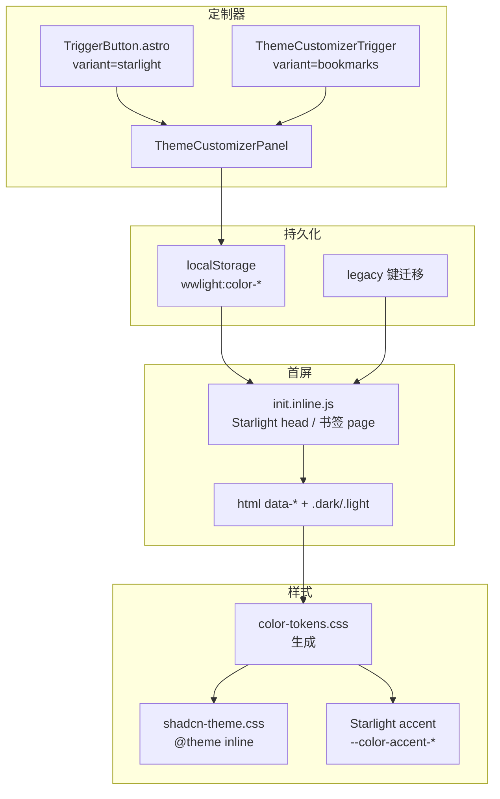

import { LinkCard, CardGrid } from '@astrojs/starlight/components';

`src/theme/` 负责 Starlight 文档站与书签 React 页面的统一主题：首屏无闪烁、`localStorage` 持久化、跨标签同步、View Transition 明暗切换。

## 范围

- `html[data-theme]` / `data-color-*` / `data-radius` 驱动 CSS token
- `scripts/color-themes.data.mjs` 生成 `color-tokens.css` 与选项清单
- Starlight `--sl-color-*` 与书签 shadcn `--primary` / `--background` 双轨消费
- 首屏内联 `init.inline.js`、运行时 `@/theme` API、定制器 UI

## 架构

## 技术选型

| 决策 | 选型 | 理由 |
| --- | --- | --- |
| 状态落点 | `document.documentElement` 的 `data-*` | CSS 选择器直接驱动 token，SSR/CSR 一致 |
| 配色清单 | 单文件 `color-themes.data.mjs` + 生成 CSS | 18 primary × 9 neutral × 5 radius 组合不宜手写 |
| Primary 色阶 | Nuxt UI 约定：亮 `500` / 暗 `400` | 与 Tailwind 色板对齐，Black 特殊反转 |
| 书签组件色 | shadcn 语义变量（HSL） | Radix + Tailwind `@theme inline` 消费 |
| Starlight 强调色 | `--color-accent-*` 映射 primary | 侧栏、链接、搜索框跟随 primary |
| 明暗动画 | View Transition API + 圆形 clip-path | 点击位置揭示；`prefers-reduced-motion` 降级 |
| 首屏脚本 | 内联 IIFE（生成） | 避免 FOUC；书签页无 Starlight head 需单独注入 |
| 跨表面 UI | `ThemeSurface` 硬编码两套 Tailwind | 未抽共享 token（见 04 篇） |

## 文章列表

<CardGrid stagger>
  <LinkCard title="01 · 架构与技术选型" href="/blog/theme/01-architecture/" description="目录职责、data 属性模型、复刻检查清单" />
  <LinkCard title="02 · Token 生成与双轨 CSS" href="/blog/theme/02-token-generation/" description="color-themes.data.mjs、Primary/Neutral/Radius 生成规则" />
  <LinkCard title="03 · 明暗模式与全站同步" href="/blog/theme/03-color-mode-and-sync/" description="init.inline.js、storage 键、View Transition、跨标签" />
  <LinkCard title="04 · Starlight 与书签表面集成" href="/blog/theme/04-dual-surface/" description="ThemeSurface、触发器挂载、样式入口差异" />
</CardGrid>

局部文档见 [`src/theme/README.md`](https://github.com/wwlight/wwlight.github.io/blob/main/src/theme/README.md)。书签 / Starlight 壳层见 [书签系列](/blog/bookmarks/) / [Starlight 系列](/blog/starlight/)。
